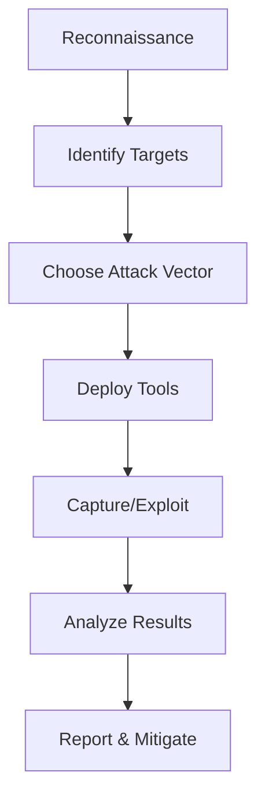

- [CompTIA Pentest+ Exam PT0-002](#comptia-pentest-exam-pt0-002)
- [1.0 Planning and Scoping](#10-planning-and-scoping)
  - [1.1 Compare and contrast governance, risk, and compliance concepts](#11-compare-and-contrast-governance-risk-and-compliance-concepts)
    - [🏛️ Governance vs ⚖️ Compliance vs ⚠️ Risk](#️-governance-vs-️-compliance-vs-️-risk)
    - [🧾 Regulatory Compliance Considerations](#-regulatory-compliance-considerations)
    - [🌍 Location-Based Restrictions](#-location-based-restrictions)
    - [📑 Legal Concepts](#-legal-concepts)
    - [🕵️ Permission to Attack](#️-permission-to-attack)
  - [1.2 Explain the importance of scoping and organizational/customer requirements](#12-explain-the-importance-of-scoping-and-organizationalcustomer-requirements)
    - [📐 Standards and Methodologies](#-standards-and-methodologies)
    - [📜 Rules of Engagement](#-rules-of-engagement)
    - [🧭 Environmental Considerations](#-environmental-considerations)
    - [🎯 Target List / In-Scope Assets](#-target-list--in-scope-assets)
    - [✅ Validate Scope of Engagement](#-validate-scope-of-engagement)
  - [1.3 Given a scenario, demonstrate an ethical hacking mindset by maintaining professionalism and integrity](#13-given-a-scenario-demonstrate-an-ethical-hacking-mindset-by-maintaining-professionalism-and-integrity)
    - [🕵️ Vetting the Team](#️-vetting-the-team)
    - [📋 Scope Adherence](#-scope-adherence)
    - [🚨 Identifying \& Reporting Criminal Activity](#-identifying--reporting-criminal-activity)
    - [🔒 Maintaining Confidentiality](#-maintaining-confidentiality)
    - [⚠️ Risk to the Professional](#️-risk-to-the-professional)
    - [✅ Recap](#-recap)
- [2.0 Information Gathering and Vulnerability Scanning](#20-information-gathering-and-vulnerability-scanning)
  - [2.1 Given a scenario, perform passive reconnaissance](#21-given-a-scenario-perform-passive-reconnaissance)
    - [🌐 DNS Lookups](#-dns-lookups)
    - [👥 Contact Discovery](#-contact-discovery)
    - [☁️ Hosting Insight: Cloud vs. Self-Hosted](#️-hosting-insight-cloud-vs-self-hosted)
    - [🧑‍💼 Social Media Scraping](#-social-media-scraping)
    - [🔐 Cryptographic Flaws](#-cryptographic-flaws)
    - [🧭 Reputation \& Security Posture](#-reputation--security-posture)
    - [🗃️ Data Exposure](#️-data-exposure)
    - [🔎 Open-Source Intelligence (OSINT)](#-open-source-intelligence-osint)
  - [2.2 Given a scenario, perform active reconnaissance](#22-given-a-scenario-perform-active-reconnaissance)
    - [🧾 Enumeration](#-enumeration)
    - [🌐 Website Reconnaissance](#-website-reconnaissance)
    - [🛠️ Packet Crafting](#️-packet-crafting)
    - [🛡️ Defense Detection](#️-defense-detection)
    - [🔐 Token Enumeration](#-token-enumeration)
    - [🚗 Wardriving](#-wardriving)
    - [🌐 Network Traffic](#-network-traffic)
    - [☁️ Cloud Asset Discovery](#️-cloud-asset-discovery)
    - [🔌 Third-Party Hosted Services](#-third-party-hosted-services)
    - [🕶️ Detection Avoidance](#️-detection-avoidance)
  - [2.3 Given a scenario, analyze the results of a reconnaissance exercise](#23-given-a-scenario-analyze-the-results-of-a-reconnaissance-exercise)
    - [🧬 Fingerprinting: Identifying System Characteristics](#-fingerprinting-identifying-system-characteristics)
    - [🌐 DNS Lookups](#-dns-lookups-1)
    - [🕸️ Website Crawling](#️-website-crawling)
    - [📶 Network Traffic](#-network-traffic-1)
    - [🔄 ARP Traffic](#-arp-traffic)
    - [🔍 Nmap Scans](#-nmap-scans)
    - [📂 Web Logs](#-web-logs)
    - [🔚 Final Thoughts](#-final-thoughts)
  - [2.4 Given a scenario, perform vulnerability scanning](#24-given-a-scenario-perform-vulnerability-scanning)
    - [🧠 Considerations for Vulnerability Scanning](#-considerations-for-vulnerability-scanning)
    - [🎯 Target Scanning](#-target-scanning)
    - [🛡️ Detection Evasion Settings](#️-detection-evasion-settings)
    - [🔍 Scanning Methods](#-scanning-methods)
    - [⚙️ Nmap Essentials](#️-nmap-essentials)
      - [🧬 Nmap Scripting Engine (NSE)](#-nmap-scripting-engine-nse)
    - [🤖 Automated Vulnerability Testing Tools](#-automated-vulnerability-testing-tools)
- [3.0 Attacks and Exploits](#30-attacks-and-exploits)
  - [3.1 Given a scenario, research attack vectors and perform network attacks](#31-given-a-scenario-research-attack-vectors-and-perform-network-attacks)
    - [🚦 Stress Testing for Availability](#-stress-testing-for-availability)
    - [📚 Exploit Resources](#-exploit-resources)
    - [💣 Attack Techniques](#-attack-techniques)
      - [🧬 Network-Based Attacks](#-network-based-attacks)
      - [🔐 Authentication Attacks](#-authentication-attacks)
      - [🔗 Exploit Chaining](#-exploit-chaining)
    - [🧪 Tools for Network Attacks](#-tools-for-network-attacks)
    - [🧠 Ethical Tips for Execution](#-ethical-tips-for-execution)
  - [3.2 Given a scenario, research attack vectors and perform wireless attacks](#32-given-a-scenario-research-attack-vectors-and-perform-wireless-attacks)
    - [🎯 Scenario](#-scenario)
    - [🔍 Attack Methods](#-attack-methods)
      - [📡 Eavesdropping](#-eavesdropping)
      - [✏️ Data Modification](#️-data-modification)
      - [💥 Data Corruption](#-data-corruption)
      - [🔁 Relay Attacks](#-relay-attacks)
      - [🕵️ Spoofing](#️-spoofing)
      - [🚫 Deauthentication](#-deauthentication)
      - [📶 Jamming](#-jamming)
      - [🤝 Capture Handshakes](#-capture-handshakes)
      - [🧭 On-Path (MITM)](#-on-path-mitm)
    - [💣 Wireless Attack Types](#-wireless-attack-types)
      - [👿 Evil Twin](#-evil-twin)
      - [🌐 Captive Portal](#-captive-portal)
      - [📲 Bluejacking](#-bluejacking)
      - [🧛 Bluesnarfing](#-bluesnarfing)
      - [🆔 RFID Cloning](#-rfid-cloning)
      - [🔋 BLE Attack](#-ble-attack)
      - [📢 NFC Amplification](#-nfc-amplification)
      - [🔐 WPS PIN Attack](#-wps-pin-attack)
    - [🧰 Tools](#-tools)
    - [🧪 Execution Flow](#-execution-flow)
  - [3.3 Given a scenario, research attack vectors and perform application-based attacks](#33-given-a-scenario-research-attack-vectors-and-perform-application-based-attacks)
    - [📋 Scenario Overview](#-scenario-overview)
    - [🔟 OWASP Top 10 Attack Vectors](#-owasp-top-10-attack-vectors)
    - [🧨 Injection Attacks](#-injection-attacks)
      - [🔹 SQL Injection](#-sql-injection)
      - [🔹 Command Injection](#-command-injection)
      - [🔹 LDAP Injection](#-ldap-injection)
    - [🕸️ Cross-Site Scripting (XSS)](#️-cross-site-scripting-xss)
      - [🔸 Persistent XSS](#-persistent-xss)
      - [🔸 Reflected XSS](#-reflected-xss)
    - [🔁 Application Vulnerabilities](#-application-vulnerabilities)
      - [⚠️ Session Attacks](#️-session-attacks)
    - [🔌 API Attacks](#-api-attacks)
    - [📂 Directory Traversal](#-directory-traversal)
    - [🧰 Tools for Simulation](#-tools-for-simulation)
    - [📚 Resources](#-resources)
    - [🧪 Sample Workflow](#-sample-workflow)
  - [3.4 Given a scenario, research attack vectors and perform attacks on cloud technologies](#34-given-a-scenario-research-attack-vectors-and-perform-attacks-on-cloud-technologies)
    - [📋 Scenario](#-scenario-1)
    - [🔐 Credential Harvesting](#-credential-harvesting)
    - [📈 Privilege Escalation](#-privilege-escalation)
    - [👤 Account Takeover](#-account-takeover)
    - [🧠 Metadata Service Attack](#-metadata-service-attack)
    - [⚙️ Misconfigured Cloud Assets](#️-misconfigured-cloud-assets)
      - [🔑 Identity and Access Management (IAM)](#-identity-and-access-management-iam)
      - [🔗 Federation Misconfiguration](#-federation-misconfiguration)
      - [🗃️ Object Storage](#️-object-storage)
      - [🐳 Containerization Technologies](#-containerization-technologies)
    - [🔄 Resource Exhaustion](#-resource-exhaustion)
    - [🦠 Cloud Malware Injection](#-cloud-malware-injection)
    - [🚫 Denial-of-Service (DoS)](#-denial-of-service-dos)
    - [🧬 Side-Channel Attacks](#-side-channel-attacks)
    - [🧭 Direct-to-Origin Attacks](#-direct-to-origin-attacks)
    - [🛠️ Tools: Software Development Kits (SDKs)](#️-tools-software-development-kits-sdks)
      - [✨ Role in Cloud Attacks](#-role-in-cloud-attacks)
  - [3.5 Explain common attacks and vulnerabilities against specialized systems](#35-explain-common-attacks-and-vulnerabilities-against-specialized-systems)
    - [📱 Mobile Systems](#-mobile-systems)
      - [🔧 Common Attacks](#-common-attacks)
      - [⚠️ Vulnerabilities](#️-vulnerabilities)
      - [🛠️ Tools](#️-tools)
    - [🌐 Internet of Things (IoT)](#-internet-of-things-iot)
      - [🧪 BLE Attacks](#-ble-attacks)
      - [❗ Special Considerations](#-special-considerations)
      - [⚠️ Vulnerabilities](#️-vulnerabilities-1)
    - [🗄️ Data Storage Systems](#️-data-storage-systems)
      - [⚠️ Vulnerabilities](#️-vulnerabilities-2)
    - [🧩 Management Interfaces](#-management-interfaces)
      - [⚠️ Vulnerabilities](#️-vulnerabilities-3)
    - [🏭 SCADA / IIoT / ICS](#-scada--iiot--ics)
      - [⚠️ Vulnerabilities](#️-vulnerabilities-4)
    - [🧠 Virtual Environments](#-virtual-environments)
      - [⚠️ Vulnerabilities](#️-vulnerabilities-5)
    - [📦 Containerized Workloads](#-containerized-workloads)
      - [⚠️ Vulnerabilities](#️-vulnerabilities-6)
  - [3.6 Given a scenario, perform a social engineering or physical attack](#36-given-a-scenario-perform-a-social-engineering-or-physical-attack)
    - [📋 Scenario](#-scenario-2)
    - [🧠 Pretext for Approach](#-pretext-for-approach)
    - [🎣 Social Engineering Attacks](#-social-engineering-attacks)
      - [✉️ Email Phishing](#️-email-phishing)
      - [📞 Vishing](#-vishing)
      - [📲 SMS Phishing](#-sms-phishing)
      - [🔌 USB Drop Key](#-usb-drop-key)
      - [🌐 Watering Hole Attack](#-watering-hole-attack)
    - [🏃 Physical Attacks](#-physical-attacks)
      - [🚪 Tailgating](#-tailgating)
      - [🗑️ Dumpster Diving](#️-dumpster-diving)
      - [👀 Shoulder Surfing](#-shoulder-surfing)
      - [🪪 Badge Cloning](#-badge-cloning)
    - [🕵️ Impersonation Tactics](#️-impersonation-tactics)
    - [🛠️ Simulation Tools](#️-simulation-tools)
    - [🧲 Psychological Influence Techniques](#-psychological-influence-techniques)
  - [3.7 Given a scenario, perform post-exploitation techniques](#37-given-a-scenario-perform-post-exploitation-techniques)
    - [📋 Scenario](#-scenario-3)
    - [🔧 Post-Exploitation Tools](#-post-exploitation-tools)
    - [🔁 Lateral Movement](#-lateral-movement)
    - [🧱 Network Segmentation Testing](#-network-segmentation-testing)
    - [🚀 Privilege Escalation](#-privilege-escalation-1)
      - [Horizontal Escalation](#horizontal-escalation)
      - [Vertical Escalation](#vertical-escalation)
    - [🐚 Upgrading a Restrictive Shell](#-upgrading-a-restrictive-shell)
    - [🧬 Creating Foothold / Persistence](#-creating-foothold--persistence)
    - [🕵️ Detection Avoidance](#️-detection-avoidance-1)
      - [Living-Off-the-Land Techniques](#living-off-the-land-techniques)
      - [Fileless Malware](#fileless-malware)
    - [📤 Data Exfiltration](#-data-exfiltration)
    - [🧹 Covering Tracks](#-covering-tracks)
    - [🕳️ Establishing a Covert Channel](#️-establishing-a-covert-channel)
    - [🔍 Enumeration Techniques](#-enumeration-techniques)
- [4.0 Reporting and Communication](#40-reporting-and-communication)
  - [4.1 Compare and contrast important components of written reports](#41-compare-and-contrast-important-components-of-written-reports)
    - [🎯 Report Audience](#-report-audience)
    - [📚 Report Contents (unordered but structured)](#-report-contents-unordered-but-structured)
      - [🧩 Executive Summary](#-executive-summary)
      - [🗺️ Scope Details](#️-scope-details)
      - [🛠️ Methodology](#️-methodology)
      - [🧪 Findings](#-findings)
      - [📊 Metrics and Measures](#-metrics-and-measures)
      - [🛠️ Remediation](#️-remediation)
      - [🧷 Conclusion](#-conclusion)
      - [📎 Appendix](#-appendix)
    - [⏳ Storage Time for Reports](#-storage-time-for-reports)
    - [🔐 Secure Distribution](#-secure-distribution)
    - [📝 Note Taking Practices](#-note-taking-practices)
      - [During Testing](#during-testing)
      - [Screenshots](#screenshots)
    - [💡 Common Themes / Root Causes](#-common-themes--root-causes)
# CompTIA Pentest+ Exam PT0-002
# 1.0 Planning and Scoping
## 1.1 Compare and contrast governance, risk, and compliance concepts
### 🏛️ Governance vs ⚖️ Compliance vs ⚠️ Risk
| Concept                 | **Governance**                                       | **Risk Management**                                          | **Compliance**                                               |
|------------------------|------------------------------------------------------|--------------------------------------------------------------|--------------------------------------------------------------|
| **Definition**         | Strategic oversight, policies, leadership            | Identification, analysis, and mitigation of threats          | Adherence to laws, standards, and regulations                |
| **Purpose**            | Align with business goals                            | Protect assets, minimize liabilities                         | Avoid penalties and meet legal obligations                   |
| **Key Drivers**        | Corporate mission, stakeholder interests             | Threats, vulnerabilities, potential loss                     | Laws (e.g. GDPR), standards (e.g. PCI DSS)                   |
### 🧾 Regulatory Compliance Considerations
| Regulation     | Governance Impact                                  | Risk Considerations                                         | Compliance Requirements                                  |
|----------------|----------------------------------------------------|-------------------------------------------------------------|-----------------------------------------------------------|
| **PCI DSS**    | Policies for secure cardholder data handling       | Data breach, financial loss                                 | Encryption, access controls, audits                      |
| **GDPR**       | Privacy policies and data frameworks                | Fines, reputation damage                                    | Consent, breach notification, user rights                |
### 🌍 Location-Based Restrictions
| Factor                   | Governance Focus                             | Risk Implications                                        | Compliance Responsibilities                                 |
|--------------------------|----------------------------------------------|----------------------------------------------------------|-------------------------------------------------------------|
| **Country Limitations**  | Data strategy across jurisdictions           | Legal exposure                                            | Data residency, transfer laws                               |
| **Tool Restrictions**    | Technology standardization                   | Incompatibility, misuse risks                            | Approved vendor tools, audits                               |
| **Local Laws**           | Regional policy alignment                    | Legal issues, business disruption                         | Adherence to regional security laws                         |
| **Privacy Requirements** | Data architecture and governance             | Trust erosion, surveillance risks                         | Lawful processing, handling protocols                       |
| **Local Government Requirements** | Government engagement strategy       | Delays, noncompliance fines                              | Licenses, reporting, official certifications                |
### 📑 Legal Concepts
| Legal Item                | Governance Role                                | Risk Element                                              | Compliance Obligation                                     |
|--------------------------|-------------------------------------------------|-----------------------------------------------------------|-------------------------------------------------------------|
| **SLA**                  | IT service quality oversight                    | Downtime, poor service                                    | Service levels, penalties, monitoring                      |
| **Confidentiality**      | Cultural and procedural enforcement             | Espionage, data leakage                                   | NDAs, encryption, access control                           |
| **Statement of Work**    | Project clarity and oversight                   | Misaligned goals, scope creep                             | Deliverables, milestones                                   |
| **NDA**                  | Sensitive info governance                       | IP theft, reputation risk                                 | Binding terms, disclosure clauses                          |
| **Master Service Agreement** | Vendor relationship governance           | Nonperformance, liability                                 | Termination rights, legal clauses                          |
### 🕵️ Permission to Attack
| Element                   | Governance Role                                | Risk Evaluation                                            | Compliance Consideration                                   |
|---------------------------|------------------------------------------------|-------------------------------------------------------------|------------------------------------------------------------|
| **Penetration Testing Rules** | Oversight of scope and frequency            | Misinterpretation, system disruption                        | Signed legal consent (e.g. ROE, NDA)                      |
| **Authorization Process** | Approval of testers (internal/external)       | Ethical hacking risks, exposure                            | Policy compliance, legal boundaries                        |
## 1.2 Explain the importance of scoping and organizational/customer requirements
Proper scoping ensures that a security engagement is aligned with stakeholder expectations, avoids legal pitfalls, and delivers actionable results. It defines the **who, what, where, when, and how** of the test.
### 📐 Standards and Methodologies
Leveraging recognized frameworks provides consistency, repeatability, and credibility.
| Standard/Methodology                     | Purpose in Scoping                                       |
|------------------------------------------|-----------------------------------------------------------|
| **MITRE ATT&CK**                         | Threat modeling based on real-world adversarial behavior  |
| **OWASP**                                | Guidance for testing web application security risks       |
| **NIST**                                 | Broad cybersecurity frameworks for risk and control       |
| **OSSTMM**                               | Operational security testing guidelines                   |
| **PTES**                                 | End-to-end penetration testing framework                  |
| **ISSAF**                                | Detailed steps for structured information systems testing |
### 📜 Rules of Engagement
Rules of engagement define the **boundaries and limitations** to ensure ethical, legal, and safe testing.
| Factor                          | Description                                           |
|----------------------------------|-------------------------------------------------------|
| **Time of Day**                 | Avoid disruptions; match business hours or off-peak   |
| **Allowed/Disallowed Tests**    | E.g., no social engineering or DDoS attacks           |
| **Other Restrictions**          | Limitations on tools, access, or team involvement     |
### 🧭 Environmental Considerations
Understanding target environments helps customize test cases and tools.
| Environment       | Scoping Consideration                                   |
|------------------|----------------------------------------------------------|
| **Network**       | Internal vs. external segmentation, firewalls            |
| **Application**   | Web, mobile, APIs, legacy systems                        |
| **Cloud**         | Shared responsibility model, provider restrictions      |
### 🎯 Target List / In-Scope Assets
Clearly defining in-scope assets ensures resources are tested responsibly and results are relevant.
| Asset Type                       | Scoping Value                                               |
|----------------------------------|--------------------------------------------------------------|
| **Wireless Networks**            | SSIDs, encryption levels                                     |
| **IP Ranges**                    | Internal/external subnets, exclusions                        |
| **Domains**                      | Root domains, subdomains                                     |
| **APIs**                         | Endpoints, authentication scopes                             |
| **Physical Locations**           | Office sites, data centers                                   |
| **DNS**                          | Zones, records, redirect paths                               |
| **External vs. Internal Targets**| Internet-facing vs. inside perimeter                         |
| **First vs. Third-Party Hosted** | Cloud vendor platforms, outsourcing impacts                  |
### ✅ Validate Scope of Engagement
Confirming scope is **critical to reduce misunderstandings, manage risk, and improve efficiency**.
| Action                                    | Objective                                                  |
|------------------------------------------|-------------------------------------------------------------|
| **Question the Client / Review Contracts** | Clarify expectations, gather permission                    |
| **Time Management**                      | Align testing with operational priorities                   |
| **Strategy**                             | Choose testing style: unknown vs. known environments         |
| **Unknown-environment Testing**          | Black-box methodology                                      |
| **Known-environment Testing**            | White-box or gray-box approach                             |

Scoping isn’t just paperwork—it’s the **foundation** of a successful cybersecurity assessment. Without clear boundaries, even the most sophisticated test can turn into a legal headache or a missed opportunity.
## 1.3 Given a scenario, demonstrate an ethical hacking mindset by maintaining professionalism and integrity
Ethical hackers operate at the intersection of trust, technical expertise, and legal boundaries. Demonstrating a responsible mindset is not just about doing the job well—it's about ensuring that the **entire engagement is carried out with integrity, accountability, and professionalism.**
### 🕵️ Vetting the Team
| Action                         | Purpose                                                    |
|--------------------------------|------------------------------------------------------------|
| **Background Checks**          | Ensure ethical history, avoid conflicts of interest        |
| **Certification Verification** | Confirm skills align with the engagement scope             |
| **Employment/Reference Reviews**| Validate credibility and past performance                  |
### 📋 Scope Adherence
| Principle                             | Example                                                    |
|--------------------------------------|-------------------------------------------------------------|
| **Stick to Defined Boundaries**      | Only test agreed-upon systems (e.g., exclude production DB) |
| **Restrict Tool Usage**              | Avoid using custom tools beyond approved set                |
| **Limit Invasiveness**               | Use non-disruptive methods unless authorized                |

Violating scope can lead to **legal consequences, reputational damage**, or loss of client trust.
### 🚨 Identifying & Reporting Criminal Activity
| Scenario                             | Required Ethical Response                                    |
|--------------------------------------|---------------------------------------------------------------|
| **Discovering Illegal Content**      | Immediately halt testing and report to appropriate authorities |
| **Unintentional Breach**             | Inform client and document incident thoroughly                |
| **Suspicious System Behavior**       | Flag for further analysis; maintain transparency              |

Ethical hackers must **never ignore criminal indicators**—integrity means prioritizing safety and legality over curiosity.
### 🔒 Maintaining Confidentiality
| Commitment                            | Description                                                  |
|---------------------------------------|--------------------------------------------------------------|
| **Protect Sensitive Data**            | Do not access PII unless required and permitted               |
| **Disclose Only to Stakeholders**     | Avoid casual conversations about findings                    |
| **Respect NDAs and Agreements**       | Adhere to signed confidentiality clauses                     |

Even if tempting or humorous, **leaking any engagement detail violates professional trust.**
### ⚠️ Risk to the Professional
| Risk Type          | Trigger Event                                        | Consequence                                   |
|--------------------|------------------------------------------------------|-----------------------------------------------|
| **Fees/Fines**     | Breach of contract, scope violations                 | Financial penalties from client or regulators |
| **Criminal Charges**| Unauthorized access, failure to report illegal activity | Jail time, lawsuit, revoked certifications    |

The stakes for ethical hackers are high—it’s why **consent, contracts, and communication** are crucial.
### ✅ Recap
Ethical hacking isn't just technical mastery—it's about upholding values. That includes:

- ✅ Knowing and respecting the rules of engagement
- ✅ Being transparent with findings and behaviors
- ✅ Protecting the client, the public, and yourself

The mindset is built on **trustworthiness, vigilance, and humility**—and that’s what transforms a penetration tester into a true cybersecurity professional.
# 2.0 Information Gathering and Vulnerability Scanning
## 2.1 Given a scenario, perform passive reconnaissance
Passive reconnaissance involves collecting information about a target **without actively engaging or alerting the system**. It’s the art of stealthy discovery—preparing the ground for potential security testing by analyzing what’s already exposed to the public.
### 🌐 DNS Lookups
| Technique             | Insight Gained                                         |
|----------------------|--------------------------------------------------------|
| **WHOIS Records**     | Domain registrant, contact emails                      |
| **DNS Records**       | MX, NS, A, TXT records; subdomain enumeration          |
| **Reverse DNS**       | Domain-to-IP mapping                                  |
### 👥 Contact Discovery
| Method                         | Purpose                                           |
|--------------------------------|---------------------------------------------------|
| **Identify Technical Contacts**| Can help validate scope and detect exposed emails |
| **Administrator Contacts**     | Targets for social engineering or reporting       |

These contacts may be surfaced through WHOIS data, corporate pages, or press releases.
### ☁️ Hosting Insight: Cloud vs. Self-Hosted
| Clues to Look For                    | What They Reveal                                 |
|-------------------------------------|--------------------------------------------------|
| **DNS Entries**                     | May point to AWS, Azure, GCP                     |
| **SSL Certificates Issuers**        | Cloud-based CA vs. internal PKI                  |
| **IP Geolocation & ASN Lookups**    | Reveal hosting providers or ISP origin           |
### 🧑‍💼 Social Media Scraping
| Information Type                       | Utility                                             |
|----------------------------------------|-----------------------------------------------------|
| **Key Contacts & Job Roles**           | Find devs/admins working on sensitive systems       |
| **Technology Stack via Job Listings**  | Reveal internal tools, frameworks, OS preferences   |

LinkedIn, GitHub, Twitter, and job boards are gold mines for tech-stack reconnaissance.
### 🔐 Cryptographic Flaws
| Target                                    | Recon Outcome                                       |
|-------------------------------------------|-----------------------------------------------------|
| **SSL Certificates**                      | Expiry dates, weak ciphers, issuer authority       |
| **Certificate Revocation Status**         | Detect retired or compromised certs                |
| **TLS Configurations**                    | Via third-party scanners (e.g., SSL Labs)          |

Weak crypto can signal potential vectors for downgrade attacks or MiTM vulnerabilities.
### 🧭 Reputation & Security Posture
| Intelligence Source               | What You Discover                                   |
|----------------------------------|-----------------------------------------------------|
| **Security Breach Records**      | Previous incidents, response quality                |
| **Online Reviews & Forums**      | Public perception and insider insights              |
| **Third-party Ratings**          | Tools like BitSight, UpGuard for external evaluations|

This can hint at organizational maturity and possible negligence.
### 🗃️ Data Exposure
| Discovery Method                        | Examples of Data Found                             |
|-----------------------------------------|-----------------------------------------------------|
| **Password Dumps**                      | Leaked credentials from breaches                   |
| **File Metadata**                       | Author names, editing software, timestamps         |
| **Strategic Search Engine Queries**     | `site:example.com filetype:pdf` tricks             |
| **Archived Pages (Wayback Machine)**    | Older versions of sites, retired endpoints         |
| **Public Repos (GitHub, GitLab)**       | Hardcoded keys, internal documentation             |

Passive recon here can dig up serious exposure without touching the target.
### 🔎 Open-Source Intelligence (OSINT)
| Tool/Source            | Functionality                                         |
|------------------------|--------------------------------------------------------|
| **Shodan**             | Internet-exposed assets with banners (e.g. SSH, RDP)   |
| **Recon-ng**           | Automated recon framework with modular intel gathering |
| **CWE**                | Lists of systemic software weakness patterns           |
| **CVE**                | Known security vulnerabilities linked to software      |

These sources help triangulate known flaws and assess probable risks based on tech stack.

Passive reconnaissance is like assembling a puzzle from pieces the target didn’t know it dropped. It **lays the foundation** for a focused, respectful, and ethical testing engagement—especially when scoped correctly.
## 2.2 Given a scenario, perform active reconnaissance
Active reconnaissance involves **engaging with the target’s systems directly** to extract data—often louder and more detectable than passive recon. It's the controlled probing used to prepare for deeper testing and exploitation.
### 🧾 Enumeration
| Target Element       | Method                                                 | Purpose                                           |
|----------------------|--------------------------------------------------------|--------------------------------------------------|
| **Hosts**            | ICMP ping sweeps, traceroutes                          | Identify live systems                            |
| **Services**         | Port scanning (e.g., Nmap), banner grabbing            | Discover running services and versions           |
| **Domains**          | Subdomain brute-force, DNS zone transfers              | Expand attack surface                            |
| **Users**            | SMB enumeration, LDAP queries                          | Identify valid usernames, group memberships      |
| **URLs**             | Directory fuzzing, spidering tools                     | Uncover hidden endpoints                         |
### 🌐 Website Reconnaissance
| Technique                      | What You Learn                                      |
|-------------------------------|-----------------------------------------------------|
| **Crawling Websites**         | Site structure, dynamic content                     |
| **Scraping Websites**         | Extract metadata, embedded URLs, contact info       |
| **Manual Link Inspection**    | Review `robots.txt`, uncover disallowed paths       |

Popular tools: Burp Suite Spider, OWASP ZAP, or even Python’s `requests` + `BeautifulSoup`.
### 🛠️ Packet Crafting
| Tool         | Use Case                                             |
|--------------|------------------------------------------------------|
| **Scapy**    | Create and manipulate packets for custom tests       |

Scapy helps bypass filters, test firewall rules, or simulate specific protocol behaviors.
### 🛡️ Defense Detection
| Defense Mechanism         | Detection Technique                           |
|---------------------------|------------------------------------------------|
| **Load Balancer**         | Inconsistent response times or header anomalies|
| **Web App Firewall (WAF)**| Regex filtering, behavior-based blocking       |
| **Antivirus**             | Binary upload tests, sandbox behavior checks   |
| **Firewall**              | Port response timing, packet filtering         |

Understanding these helps fine-tune stealth and payload selection.
### 🔐 Token Enumeration
| Aspect             | Recon Application                                       |
|--------------------|--------------------------------------------------------|
| **Scoping**         | Discover token access boundaries                       |
| **Issuing**         | Analyze how tokens are granted (e.g., OAuth flows)     |
| **Revocation**      | Identify mechanisms for invalidating access            |

Tokens are often found in headers or embedded in JavaScript during API enumeration.
### 🚗 Wardriving
| Component              | Recon Value                                         |
|------------------------|-----------------------------------------------------|
| **Wireless Scanning**  | Uncover SSIDs, signal strength, encryption types    |
| **GPS Logging**        | Associate network data with physical coordinates    |

This technique is valuable when mapping corporate wireless footprints.
### 🌐 Network Traffic
| Technique                              | Intelligence Yielded                                   |
|----------------------------------------|---------------------------------------------------------|
| **Capture API Requests/Responses**     | Extract endpoints, data structures, tokens              |
| **Sniffing**                           | Monitor protocol use, credentials in transit            |

Tools like Wireshark and tcpdump are standard here—ensure scope allows!
### ☁️ Cloud Asset Discovery
| Method                                | What to Discover                                       |
|---------------------------------------|--------------------------------------------------------|
| **Cloud Metadata Services**           | Instance info, storage, IAM roles                      |
| **Subdomain Enumeration**             | Detect cloud-hosted services (e.g., *.s3.amazonaws.com)|
| **Bucket Scanning**                   | Identify misconfigured public storage buckets          |
### 🔌 Third-Party Hosted Services
| Example Sources           | Recon Opportunities                                       |
|---------------------------|-----------------------------------------------------------|
| **GitHub, GitLab**        | Hardcoded secrets, credentials, internal documentation    |
| **Project Management Tools**| Leaked URLs, file previews, internal URLs              |
| **Publicly Indexed Tools** | JIRA, Jenkins, Salesforce (sometimes misconfigured)      |

Discovering integrations is key to lateral movement and pivoting.
### 🕶️ Detection Avoidance
| Technique                        | Purpose                                               |
|----------------------------------|--------------------------------------------------------|
| **Randomizing Requests**         | Evade rate-limiting and bot detection                  |
| **Using Proxy Chains**           | Obfuscate source IP addresses                          |
| **Throttling Scan Intensity**    | Avoid triggering alarms                               |
| **Timing Analysis**              | Detect active defenses based on response patterns      |

Balance stealth with thoroughness. Ethics and scope **always come first**.

---

Active reconnaissance turns digital sleuthing into a methodical probe—but only when you're scoped, skilled, and acting responsibly. One wrong packet in the wrong place, and you're not hacking—you’re trespassing.
## 2.3 Given a scenario, analyze the results of a reconnaissance exercise
After gathering intelligence during recon, the next step is to **analyze the findings** to uncover patterns, identify vulnerabilities, and fine-tune your attack or defense strategy.
### 🧬 Fingerprinting: Identifying System Characteristics
| Target Element       | Analysis Outcome                                      |
|----------------------|--------------------------------------------------------|
| **Operating Systems (OSs)** | Use TCP/IP stack behavior or TTL values to identify OS (e.g., Windows vs. Linux) |
| **Networks**         | Detect segmentation, VPNs, NAT traversal, or mesh setups |
| **Network Devices**  | Identify hardware via MAC vendor, banners (e.g., Cisco, Juniper) |
| **Software**         | Version detection via service banners (Apache 2.4.49, etc.) for vulnerability mapping |

Fingerprinting reveals what you're dealing with—vital for exploit selection.
### 🌐 DNS Lookups
| Insight                             | Interpretation                                        |
|------------------------------------|--------------------------------------------------------|
| **MX Records**                     | Email infrastructure; spam/phishing entry points       |
| **TXT/SPF/DMARC Records**          | Email validation policies; misconfigurations are exploitable |
| **Subdomain Enumeration**          | Uncover hidden applications (e.g., dev.example.com)    |
| **SOA Records**                    | Reveal admin contacts, TTL values                      |

Unusual DNS entries can hint at forgotten services, staging environments, or legacy systems.
### 🕸️ Website Crawling
| Discovery                         | Strategic Relevance                                    |
|-----------------------------------|--------------------------------------------------------|
| **robots.txt**                    | Hidden directories, admin panels, sensitive endpoints  |
| **Sitemap.xml**                   | Gives full map of URLs for fuzzing or analysis         |
| **Meta Tags / Comments**          | Leak technology stack, developers’ names               |
| **Error Pages & Redirects**       | Help detect web server type, application logic         |

Sometimes, vulnerabilities hide in plain sight—right in outdated or misconfigured pages.
### 📶 Network Traffic
| Captured Element                  | What to Look For                                       |
|-----------------------------------|--------------------------------------------------------|
| **Unencrypted Protocols (HTTP, FTP)** | Potential data leakage, credentials in transit     |
| **API Tokens / Session Cookies**  | Reusability or expiration logic                       |
| **Repetitive Patterns**           | Automated services, background syncs, third-party calls |
| **Header Analysis**               | Detect frameworks (e.g., `X-Powered-By: Express`)      |

Identifying sensitive data in transit is crucial for assessing exposure.
### 🔄 ARP Traffic
| Observation                        | Possible Implications                                  |
|------------------------------------|--------------------------------------------------------|
| **Frequent ARP Requests**          | Device scanning or misconfigured broadcast behavior     |
| **Gratuitous ARP**                 | Suspicious device asserting ownership of IP/MAC pairs  |
| **Spoofed ARP Replies**            | Indicator of MITM setup or rogue device presence       |

ARP anomalies can indicate active threats—or security gaps in segmentation.
### 🔍 Nmap Scans
| Output Detail                      | Interpretation                                         |
|------------------------------------|--------------------------------------------------------|
| **Open Ports**                     | Access vectors (SSH, SMB, HTTP, etc.)                  |
| **Service Versions**               | Enables vulnerability matching with CVEs               |
| **OS Detection**                   | Cross-validates fingerprinting efforts                 |
| **Traceroute Results**             | Network topology insights, potential chokepoints       |

Use the Nmap output to profile reachable systems and develop lateral movement paths.
### 📂 Web Logs
| Log Entry Type                     | Significance                                           |
|------------------------------------|--------------------------------------------------------|
| **404 Errors**                     | Missing paths that might once have existed            |
| **User-Agent Strings**            | Reveal scanning tools or suspicious automation         |
| **Referrer Headers**              | Track inbound links and possible data leakage          |
| **POST/GET Payloads**             | Catch suspicious data submissions                      |
| **Login/Session Events**          | Evaluate authentication mechanisms                     |

Correlating logs with observed behaviors helps validate recon data and anticipate next steps.
### 🔚 Final Thoughts
The real power of reconnaissance lies in **connecting the dots**—not just collecting data, but understanding what it means in the context of the environment. It's the bridge between curiosity and capability.
## 2.4 Given a scenario, perform vulnerability scanning
Vulnerability scanning identifies weaknesses in systems, applications, or configurations that could be exploited. A successful scan balances **depth, stealth, and accuracy**—with careful consideration for the environment and scope.
### 🧠 Considerations for Vulnerability Scanning
| Consideration         | Description                                                  |
|----------------------|--------------------------------------------------------------|
| **Time to Run Scans**| Choose off-peak hours to avoid operational disruptions        |
| **Protocols**         | Align with target services (e.g., TCP, UDP, HTTP, SNMP)      |
| **Network Topology**  | Consider DMZ, VPNs, segmented networks, routing paths        |
| **Bandwidth Limits**  | Prevent congestion in sensitive or low-bandwidth networks    |
| **Query Throttling**  | Avoid detection and rate-limit issues; configure timeout     |
| **Fragile Systems**   | Old or unstable systems may crash under aggressive scanning  |
| **Non-Traditional Assets**| IoT devices, industrial systems require tailored scanning|
### 🎯 Target Scanning
| Action                            | Purpose                                                 |
|-----------------------------------|----------------------------------------------------------|
| **Scan Identified Targets**       | Match discovered assets from recon to tailored scans     |
| **Define Port Range (-p)**        | Limit scans to relevant services                         |
| **Use Safe Defaults**             | Avoid aggressive flags unless allowed                    |

Avoid scanning third-party assets unless explicitly scoped!
### 🛡️ Detection Evasion Settings
| Setting/Strategy                  | Effect                                                   |
|-----------------------------------|----------------------------------------------------------|
| **Timing (`-T 0–5`)**             | Control scan speed; lower values reduce detection        |
| **Ping Skipping (`-Pn`)**         | Avoid ICMP to bypass firewalls and IDS                   |
| **Randomization/Delay**          | Shuffle target list and introduce pauses                 |
| **Avoid Full Banners**            | Skip verbose queries to minimize exposure                |

Use stealth settings when testing production or monitored environments.
### 🔍 Scanning Methods
| Method                              | Description                                              |
|-------------------------------------|----------------------------------------------------------|
| **Stealth Scan (`-sS`)**            | SYN scan; minimally invasive                            |
| **TCP Connect (`-sT`)**             | Standard TCP scan; more detectable                       |
| **UDP Scan (`-sU`)**                | Detect services over UDP                                 |
| **Credentialed Scan**              | Access with valid creds for deep inspection              |
| **Non-Credentialed Scan**          | Surface-level evaluation without logins                  |

Credentialed scans are ideal for configuration audits; non-credentialed for attack-surface mapping.
### ⚙️ Nmap Essentials
| Option            | Functionality                                            |
|-------------------|----------------------------------------------------------|
| `-A`              | Aggressive scan with version, OS, script, and traceroute |
| `-sV`             | Service version detection                                |
| `-O`              | OS detection                                             |
| `-Pn`             | Disable host discovery                                   |
| `-sU` / `-sS`     | UDP/TCP scan types                                       |
| `-T 0–5`          | Timing template (slower = stealthier)                    |
| `-script=vuln`    | Launch vulnerability-specific NSE scripts                |
| `-p`              | Specify ports or ranges                                  |
#### 🧬 Nmap Scripting Engine (NSE)
| NSE Category              | Example Script                                  |
|---------------------------|--------------------------------------------------|
| **Vulnerability Detection**| `http-vuln-cve2017-5638`, `smb-vuln-ms17-010`  |
| **Authentication Bypass** | `ftp-anon`, `http-auth-finder`                 |
| **Information Disclosure**| `dns-zone-transfer`, `ssl-cert`, `ip-id`       |

Scripts extend Nmap’s scanning capabilities with targeted insights.
### 🤖 Automated Vulnerability Testing Tools
| Tool              | Capabilities                                           |
|-------------------|--------------------------------------------------------|
| **OpenVAS**       | Free, comprehensive scanner with a vast vulnerability feed |
| **Nessus**        | Commercial-grade tool with frequent plugin updates     |
| **Qualys**        | Cloud-based scanner suitable for large environments    |
| **Nikto**         | Web server-focused vulnerability scanner               |
| **Burp Suite (Pro)** | Dynamic application scanner with automation features|
| **Rapid7 InsightVM** | Asset management, scanning, and remediation tracking |

Automation helps scale vulnerability testing and integrate findings into lifecycle workflows.

---

Vulnerability scanning isn't just pressing a button—it's **context-driven, customized, and cautious**. The goal is to illuminate risk while minimizing impact.
# 3.0 Attacks and Exploits
## 3.1 Given a scenario, research attack vectors and perform network attacks
When performing ethical network attacks during a penetration test, it’s critical to first **research vectors**, understand the **potential impact**, and operate within clearly defined **rules of engagement**. Below is a structured overview using Markdown.
### 🚦 Stress Testing for Availability
| Technique         | Purpose                                                |
|------------------|--------------------------------------------------------|
| **Flooding**      | Send excessive traffic to test resource limits         |
| **Protocol Abuse**| Exploit weaknesses in protocol handling (e.g., HTTP, ICMP) |
| **Simulated DDoS**| Validate load balancer and mitigation capabilities     |

> ⚠️ Always ensure stress tests are permitted—these can easily disrupt business operations.
### 📚 Exploit Resources
| Source               | Use Case                                             |
|----------------------|------------------------------------------------------|
| **Exploit Database (exploit-db.com)** | Find PoCs for known CVEs on software/services |
| **Packet Storm Security**         | Scripts, advisories, and exploit tools         |

Use these platforms to correlate known vulnerabilities to identified targets from scans.
### 💣 Attack Techniques
#### 🧬 Network-Based Attacks
| Attack Type                    | Description                                       |
|--------------------------------|---------------------------------------------------|
| **ARP Poisoning**              | Redirect traffic by spoofing MAC-to-IP mappings  |
| **On-path Attacks (MitM)**     | Intercept/modify traffic between devices          |
| **DNS Cache Poisoning**        | Redirect users to malicious sites via DNS tampering |
| **MAC Spoofing**               | Impersonate a trusted device to gain access       |
| **NAC Bypass**                 | Circumvent network admission controls             |
| **VLAN Hopping**               | Move laterally between logically separated networks|
#### 🔐 Authentication Attacks
| Type                     | Target                                                 |
|--------------------------|--------------------------------------------------------|
| **Password Spraying**    | Try one password across many usernames                |
| **Hash Cracking**        | Use tools like Hashcat or John to brute-force hashes  |
| **Brute Force**          | Attempt all character combinations against a login     |
| **Dictionary Attacks**   | Use known words/lists to guess passwords               |
| **Kerberoasting**        | Extract and crack Kerberos service tickets             |
| **NTLM Relay**           | Hijack NTLM authentication traffic                    |
| **LLMNR/NBT-NS Poisoning**| Respond to name resolution requests to capture hashes |
#### 🔗 Exploit Chaining
| Strategy                  | Purpose                                                  |
|---------------------------|----------------------------------------------------------|
| **Chain Multiple Exploits**| Escalate access by linking vulnerabilities (e.g., RCE → Priv Esc → Credential Dump) |

Exploit chaining requires creativity and deep understanding of target architecture.
### 🧪 Tools for Network Attacks
| Tool        | Capabilities                                          |
|-------------|-------------------------------------------------------|
| **Metasploit** | Framework for exploit development, delivery, post-exploitation |
| **Netcat**     | Swiss-army knife for reading/writing across network connections |
| **Nmap**       | Scanning + scripting engine (`--script=vuln`, OS detection, versioning) |

Additional tools for specific tasks:
- **Ettercap / Bettercap** for MitM attacks
- **Responder** for LLMNR/NBT-NS spoofing
- **Impacket** for Kerberoasting and NTLM relay
### 🧠 Ethical Tips for Execution
- ✅ Always work within scope and with signed authorization
- ✅ Avoid destructive payloads unless explicitly permitted
- ✅ Document every step to maintain transparency
- ✅ Report signs of real compromise immediately

---

Network attacks are **powerful diagnostic tools** when used ethically and skillfully. The goal isn’t destruction—it’s revelation.
## 3.2 Given a scenario, research attack vectors and perform wireless attacks
### 🎯 Scenario
You're tasked with assessing the security of a corporate wireless network used by employees and IoT devices. The goal is to identify vulnerabilities and simulate realistic wireless attacks to test defenses.
### 🔍 Attack Methods
#### 📡 Eavesdropping
- **Goal**: Intercept unencrypted wireless traffic.
- **Technique**: Use packet sniffers (e.g., Wireshark, tcpdump) to capture data.
- **Target**: Open or weakly encrypted Wi-Fi networks.
- **Mitigation**: Use WPA3, VPNs, and encrypted protocols.
#### ✏️ Data Modification
- **Goal**: Alter packets in transit.
- **Technique**: Perform MITM attacks using tools like Ettercap or Bettercap.
- **Target**: HTTP traffic, ARP tables.
- **Mitigation**: Use HTTPS, certificate pinning, and secure DNS.
#### 💥 Data Corruption
- **Goal**: Inject malformed packets to disrupt communication.
- **Technique**: Use Scapy or custom scripts to send corrupted frames.
- **Target**: IoT devices, legacy systems.
- **Mitigation**: Input validation, firmware updates.
#### 🔁 Relay Attacks
- **Goal**: Extend communication range to impersonate devices.
- **Technique**: Use two devices to relay signals (e.g., key fob to car).
- **Target**: RFID, NFC, BLE.
- **Mitigation**: Time-of-flight checks, proximity authentication.
#### 🕵️ Spoofing
- **Goal**: Impersonate legitimate devices or networks.
- **Technique**: MAC spoofing, SSID cloning.
- **Target**: Wi-Fi clients, access points.
- **Mitigation**: MAC filtering, WPA3, network segmentation.
#### 🚫 Deauthentication
- **Goal**: Force clients to disconnect from Wi-Fi.
- **Technique**: Send spoofed deauth frames using aireplay-ng.
- **Target**: WPA/WPA2 networks.
- **Mitigation**: Enable 802.11w (Protected Management Frames).
#### 📶 Jamming
- **Goal**: Disrupt wireless communication.
- **Technique**: Use high-powered antennas or signal generators.
- **Target**: Wi-Fi, Bluetooth, Zigbee.
- **Mitigation**: Frequency hopping, shielding, IDS.
#### 🤝 Capture Handshakes
- **Goal**: Obtain WPA/WPA2 handshakes for offline cracking.
- **Technique**: Use airodump-ng + aireplay-ng to force reauth.
- **Target**: Wi-Fi clients.
- **Mitigation**: Use strong passwords, WPA3.
#### 🧭 On-Path (MITM)
- **Goal**: Intercept and manipulate traffic.
- **Technique**: ARP poisoning, rogue APs.
- **Target**: Browsers, mobile apps.
- **Mitigation**: HTTPS, DNSSEC, VPN.
### 💣 Wireless Attack Types
#### 👿 Evil Twin
- **Description**: Clone a legitimate SSID to lure users.
- **Tool**: WiFi-Pumpkin, Airbase-ng.
- **Impact**: Credential theft, MITM.
#### 🌐 Captive Portal
- **Description**: Fake login page to harvest credentials.
- **Tool**: Fluxion, Bettercap.
- **Impact**: Phishing, session hijacking.
#### 📲 Bluejacking
- **Description**: Send unsolicited messages via Bluetooth.
- **Tool**: Bluetooth CLI tools.
- **Impact**: Annoyance, social engineering.
#### 🧛 Bluesnarfing
- **Description**: Unauthorized access to Bluetooth data.
- **Tool**: hcitool, obexftp.
- **Impact**: Data theft.
#### 🆔 RFID Cloning
- **Description**: Duplicate RFID tags.
- **Tool**: Proxmark3, RFIDler.
- **Impact**: Physical access bypass.
#### 🔋 BLE Attack
- **Description**: Exploit BLE pairing or sniff traffic.
- **Tool**: Btlejack, Ubertooth.
- **Impact**: Device hijacking.
#### 📢 NFC Amplification
- **Description**: Extend NFC range to relay or clone.
- **Tool**: Android NFC tools, custom antennas.
- **Impact**: Payment fraud, access spoofing.
#### 🔐 WPS PIN Attack
- **Description**: Brute-force WPS PIN to get Wi-Fi password.
- **Tool**: Reaver, Bully.
- **Impact**: Network compromise.
### 🧰 Tools
| Tool              | Purpose                                |
|-------------------|----------------------------------------|
| **Aircrack-ng**   | Capture & crack WPA/WPA2 handshakes    |
| **Aireplay-ng**   | Inject packets, deauth clients         |
| **Airodump-ng**   | Monitor Wi-Fi traffic                  |
| **Amplified Antenna** | Boost signal range for sniffing/jamming |
| **Wireshark**     | Analyze captured packets               |
| **Bettercap**     | MITM, spoofing, phishing               |
| **Reaver**        | WPS PIN brute-force                    |
| **Btlejack**      | BLE sniffing and hijacking             |
### 🧪 Execution Flow

## 3.3 Given a scenario, research attack vectors and perform application-based attacks
### 📋 Scenario Overview
You're tasked with simulating attacks on a web application to identify vulnerabilities and test its resilience. The goal is to explore various attack vectors using industry-standard tools and techniques.
### 🔟 OWASP Top 10 Attack Vectors
Explore the [OWASP Top 10](https://owasp.org/www-project-top-ten/) to understand the most critical web application security risks:
- **A01**: Broken Access Control  
- **A02**: Cryptographic Failures  
- **A03**: Injection  
- **A04**: Insecure Design  
- **A05**: Security Misconfiguration  
- **A06**: Vulnerable and Outdated Components  
- **A07**: Identification and Authentication Failures  
- **A08**: Software and Data Integrity Failures  
- **A09**: Security Logging and Monitoring Failures  
- **A10**: Server-Side Request Forgery (SSRF)  
### 🧨 Injection Attacks
#### 🔹 SQL Injection
- **Blind SQL**: Infer data using time delays or conditional responses.
- **Boolean SQL**: Use true/false logic to extract data.
- **Stacked Queries**: Execute multiple queries in one request.
#### 🔹 Command Injection
- Inject OS-level commands via vulnerable input fields.
#### 🔹 LDAP Injection
- Manipulate LDAP queries to bypass authentication or extract data.
### 🕸️ Cross-Site Scripting (XSS)
#### 🔸 Persistent XSS
- Inject scripts that are stored and executed later (e.g., in comments).
#### 🔸 Reflected XSS
- Inject scripts via URL parameters that are immediately reflected.
### 🔁 Application Vulnerabilities
- **Race Conditions**: Exploit timing issues in concurrent processes.  
- **Lack of Error Handling**: Trigger unhandled exceptions to leak info.  
- **Lack of Code Signing**: Modify unsigned code or binaries.  
- **Insecure Data Transmission**: Intercept unencrypted traffic.
#### ⚠️ Session Attacks
- **Session Hijacking**
- **Cross-Site Request Forgery (CSRF)**
- **Privilege Escalation**
- **Session Replay**
- **Session Fixation**
### 🔌 API Attacks
- **RESTful APIs**: Exploit improper authentication or input validation.  
- **XML-RPC**: Abuse XML payloads to execute remote procedures.  
- **SOAP**: Inject malicious XML into SOAP envelopes.  
### 📂 Directory Traversal
- Access restricted files using path manipulation  
  Example: `../../etc/passwd`
### 🧰 Tools for Simulation
| Tool                    | Purpose                                      |
|-------------------------|----------------------------------------------|
| **OWASP ZAP**           | Intercept, scan, and fuzz web applications   |
| **Burp Suite (Community)** | Proxy, scanner, repeater, intruder        |
| **SQLmap**              | Automated SQL injection detection            |
| **DirBuster**           | Discover hidden directories and files        |
### 📚 Resources
- **Word Lists**: Use for brute-force, fuzzing, and enumeration.  
  Examples include:
  - `SecLists`
  - `FuzzDB`
  - `RockYou.txt`
### 🧪 Sample Workflow
```markdown
1. Intercept traffic using Burp Suite.
2. Identify input fields and test for injection using SQLmap.
3. Use OWASP ZAP to spider and scan the application.
4. Attempt directory traversal using DirBuster.
5. Exploit session vulnerabilities using crafted cookies.
6. Test API endpoints with Postman or curl.
```
## 3.4 Given a scenario, research attack vectors and perform attacks on cloud technologies
### 📋 Scenario
Simulate attacks against cloud technologies to uncover vulnerabilities in identity, configuration, data storage, and resource management across IaaS, PaaS, and SaaS environments.
### 🔐 Credential Harvesting
- **Vector**: Phishing, malware, exposed secrets in code.
- **Impact**: Unauthorized access to cloud accounts.
- **Example**: Fake login pages targeting AWS or Azure credentials.
### 📈 Privilege Escalation
- **Vector**: Weak IAM roles, vulnerable service permissions.
- **Impact**: Admin-level access and lateral movement.
- **Example**: Attacker modifies IAM roles to escalate privileges.
### 👤 Account Takeover
- **Vector**: Credential stuffing, MFA bypass, session hijacking.
- **Impact**: Full user or root access to cloud consoles.
- **Example**: Leaked credentials used to access cloud dashboard.
### 🧠 Metadata Service Attack
- **Vector**: Server-side request forgery (SSRF) targeting instance metadata.
- **Impact**: Theft of IAM tokens or temp credentials.
- **Example**: Accessing `http://169.254.169.254` on EC2.
### ⚙️ Misconfigured Cloud Assets
#### 🔑 Identity and Access Management (IAM)
- **Issues**: Over-permissioned roles, lack of MFA, unused credentials.
- **Impact**: Data exfiltration, privilege abuse.
#### 🔗 Federation Misconfiguration
- **Issues**: Poorly configured SSO/SAML trust policies.
- **Impact**: Unauthorized access via identity federation.
#### 🗃️ Object Storage
- **Issues**: Public buckets, misconfigured access policies.
- **Impact**: Data exposure, ransomware payloads.
#### 🐳 Containerization Technologies
- **Issues**: Unsecured images, exposed Docker/Kubernetes APIs.
- **Impact**: Privilege escalation, host compromise.
### 🔄 Resource Exhaustion
- **Vector**: Abuse auto-scaling or event-based functions.
- **Impact**: Increased costs, service disruption.
- **Example**: Loop triggers excessive Lambda executions.
### 🦠 Cloud Malware Injection
- **Vector**: Upload malware to storage or CI/CD pipeline.
- **Impact**: Persistent access, credential theft.
### 🚫 Denial-of-Service (DoS)
- **Vector**: API abuse, request flooding.
- **Impact**: System downtime, degraded performance.
### 🧬 Side-Channel Attacks
- **Vector**: Exploit shared physical resources like CPU cache.
- **Impact**: Cross-tenant data leakage.
- **Example**: Meltdown, Spectre-style techniques.
### 🧭 Direct-to-Origin Attacks
- **Vector**: Bypass CDN/WAF protections.
- **Impact**: Direct access to unprotected backend.
- **Example**: Find origin IP, send malicious traffic.
### 🛠️ Tools: Software Development Kits (SDKs)
#### ✨ Role in Cloud Attacks
- **Credential Exposure**: Hardcoded secrets in SDK config files.
- **Privilege Overuse**: SDKs requesting full access scopes.
- **Automation**: Use SDKs to script enumeration, exfiltration, escalation.

**Example**: AWS SDK used to list all IAM roles, assume elevated privileges.
## 3.5 Explain common attacks and vulnerabilities against specialized systems
### 📱 Mobile Systems
#### 🔧 Common Attacks
- **Reverse Engineering**: Disassembling apps to retrieve logic, credentials, or secrets.
- **Sandbox Analysis**: Executing apps in isolated environments to monitor behavior.
- **Spamming**: Exploiting messaging or notification components for phishing or abuse.
#### ⚠️ Vulnerabilities
- **Insecure Storage**
- **Passcode Vulnerabilities**
- **Improper Certificate Pinning**
- **Using Known Vulnerable Components**
  - **Dependency Vulnerabilities**
  - **Patching Fragmentation**
- **Execution Using Root Privileges**
- **Permission Overreach**
- **Biometrics Integration Weaknesses**
- **Business Logic Flaws**
#### 🛠️ Tools
| Tool                    | Use Case                                  |
|-------------------------|--------------------------------------------|
| **Burp Suite**          | Web/API traffic analysis and interception |
| **Drozer**              | Android security assessment                |
| **Needle**              | iOS security testing                       |
| **MobSF**               | Static/Dynamic mobile app analysis         |
| **Postman**             | API interaction and fuzzing                |
| **Ettercap**            | MITM and sniffing                          |
| **Frida**               | Runtime instrumentation                    |
| **Objection**           | Mobile exploitation and bypass             |
| **Android SDK Tools**   | Debugging and reverse engineering          |
| **Androzer, ApkX, APK Studio** | APK decompilation and analysis   |
### 🌐 Internet of Things (IoT)
#### 🧪 BLE Attacks
- **Sniffing**
- **Spoofing**
- **Replay Attacks**
#### ❗ Special Considerations
- Fragile operational environment  
- High availability expectations  
- Susceptibility to data corruption  
- Potential for large-scale data exfiltration  
#### ⚠️ Vulnerabilities
- Insecure default settings  
- Unencrypted cleartext communications  
- Hardcoded credentials/configurations  
- Outdated firmware and hardware  
- Sensitive data leakage  
- Use of insecure or unsupported components  
### 🗄️ Data Storage Systems
#### ⚠️ Vulnerabilities
- **On-Prem & Cloud Misconfigurations**
  - Default or blank credentials
  - Open network access
- **Lack of Input Sanitization**
- **Underlying Software Flaws**
- **Error Message & Debug Info Leakage**
- **Injection Vulnerabilities**
  - Example: `' OR '1'='1` (single quote method)
### 🧩 Management Interfaces
#### ⚠️ Vulnerabilities
- **IPMI (Intelligent Platform Management Interface)**  
  - Weak auth, unencrypted channels, remote execution vectors
### 🏭 SCADA / IIoT / ICS
#### ⚠️ Vulnerabilities
- No encryption or authentication protocols  
- Exposed remote access capabilities  
- Legacy systems lacking firmware validation  
- Weak perimeter defenses  
- Unsafe update and patch processes  
### 🧠 Virtual Environments
#### ⚠️ Vulnerabilities
- **VM Escape**
- **Hypervisor Exploits**
- **VM Repository Poisoning**
### 📦 Containerized Workloads
#### ⚠️ Vulnerabilities
- Privileged containers  
- Poor image hygiene and signature validation  
- Insufficient isolation  
- Misconfigured orchestrators (e.g., Kubernetes RBAC flaws)  
## 3.6 Given a scenario, perform a social engineering or physical attack
### 📋 Scenario
You’re part of a red team hired to assess the security posture of a financial services company. Your mission: simulate how an attacker might manipulate employees or breach facilities to gain access to sensitive customer data.
### 🧠 Pretext for Approach
- **Role**: IT Support Specialist from headquarters  
- **Goal**: Gain access to workstations and internal documentation  
- **Cover Story**: You're fixing remote connectivity issues impacting executives  
### 🎣 Social Engineering Attacks
#### ✉️ Email Phishing
- **General phishing**: Spoofed company-wide email asking for login verification  
- **Whaling**: Target C-level executives with tailored messages  
- **Spear Phishing**: Personalized messages aimed at specific employees
#### 📞 Vishing
- Phone-based attacks by impersonating an executive calling help desk for urgent access
#### 📲 SMS Phishing
- Fake 2FA alerts or mobile policy updates with malicious links
#### 🔌 USB Drop Key
- Infected drives labeled “Confidential Payroll Info” left in common areas
#### 🌐 Watering Hole Attack
- Compromise a vendor website frequently visited by employees
### 🏃 Physical Attacks
#### 🚪 Tailgating
- Following employees into secure areas without authentication
#### 🗑️ Dumpster Diving
- Searching discarded materials for credentials, network maps, etc.
#### 👀 Shoulder Surfing
- Observing passwords or sensitive data over someone's shoulder
#### 🪪 Badge Cloning
- Using RFID tools to replicate employee access badges
### 🕵️ Impersonation Tactics
- Pretend to be a building inspector or technician to bypass security or gain trust
### 🛠️ Simulation Tools
| Tool                         | Purpose                                       |
|------------------------------|-----------------------------------------------|
| **BeEF**                    | Browser exploitation and real-time control     |
| **Social Engineering Toolkit** | Automates phishing, spoofing, vishing       |
| **Call Spoofing Tools**     | Fakes caller ID for voice-based attack setups |
### 🧲 Psychological Influence Techniques
| Technique      | Example Phrase                                       |
|----------------|------------------------------------------------------|
| **Authority**  | “IT Compliance needs this updated immediately.”      |
| **Scarcity**   | “This link will expire in 30 minutes.”               |
| **Social Proof** | “All staff in Finance already approved this.”     |
| **Urgency**    | “Your account is at risk—respond now.”               |
| **Likeness**   | “Wow, you went to [shared university] too?”          |
| **Fear**       | “You could lose access if this issue isn’t resolved.”|
## 3.7 Given a scenario, perform post-exploitation techniques
### 📋 Scenario
You've gained access to a low-privileged user account on a Windows workstation inside a corporate Active Directory environment. The mission is to escalate privileges, move laterally, and assess the overall network security posture.
### 🔧 Post-Exploitation Tools
| Tool        | Purpose                                                  |
|-------------|----------------------------------------------------------|
| **Empire**  | PowerShell agent for C2 operations and exploitation      |
| **Mimikatz**| Dump credentials, tickets, hashes from memory            |
| **BloodHound** | Visualize AD relationships to identify attack paths  |
### 🔁 Lateral Movement
- **Pass-the-Hash**: Use NTLM hashes to authenticate across systems without plaintext passwords  
  Tools: `psexec.py`, `wmiexec.py`, `crackmapexec`
### 🧱 Network Segmentation Testing
- Use `nmap`, `netcat`, `traceroute` to probe other VLANs or subnets  
- Identify firewall and ACL misconfigurations
### 🚀 Privilege Escalation
#### Horizontal Escalation
- Pivot to other users with similar privileges
#### Vertical Escalation
- Exploit local privilege escalation vulnerabilities:
  - Unquoted service paths
  - Weak file permissions
  - DLL hijacking
### 🐚 Upgrading a Restrictive Shell
- Spawn interactive shell:
  - `python -c 'import pty; pty.spawn("/bin/bash")'`
  - Use `socat`, `rlwrap`, or `ConPtyShell` for Windows shell enhancements
### 🧬 Creating Foothold / Persistence
- **Trojanized Binaries**: Replace executables with malicious versions  
- **Backdoors**:
  - **Bind Shell**: Listens for inbound connections
  - **Reverse Shell**: Connects back to C2 server
- **Daemons**: Create hidden background services
- **Scheduled Tasks**: `schtasks`, `at`, `cron jobs` for persistence
### 🕵️ Detection Avoidance
#### Living-Off-the-Land Techniques
- Use native utilities to avoid detection:
  - `PsExec`
  - `WMI`
  - `PowerShell Remoting`
  - `WinRM`
#### Fileless Malware
- Operates entirely in memory using native scripting
### 📤 Data Exfiltration
- Compress and encrypt sensitive data  
- Transmit via:
  - HTTPS
  - DNS tunneling
  - Cloud APIs
- Hide data using steganography (e.g., in images)
### 🧹 Covering Tracks
- Clear event logs: `wevtutil`, `Clear-EventLog`  
- Remove temp files, scripts, registry artifacts  
- Alter timestamps, disable auditing
### 🕳️ Establishing a Covert Channel
- Communicate secretly using protocols like:
  - ICMP
  - DNS
  - HTTP/S  
- Example tools: `dnscat2`, `iodine`, custom C2 frameworks
### 🔍 Enumeration Techniques
| Item            | Method                                             |
|-----------------|----------------------------------------------------|
| **Users**       | `net user`, `Get-ADUser`, `whoami /all`            |
| **Groups**      | `net localgroup`, `Get-ADGroupMember`              |
| **Forests**     | `Get-ADForest`, BloodHound                         |
| **Sensitive Data** | Keyword searches in docs or configs           |
| **Unencrypted Files** | Look for plaintext passwords, secrets       |
# 4.0 Reporting and Communication
## 4.1 Compare and contrast important components of written reports
Written reports are a vital deliverable in cybersecurity assessments and pentests. They bridge the gap between technical findings and actionable business decisions. Below is a comparison and breakdown of essential components of a quality report.
### 🎯 Report Audience
| Audience               | Needs                                            | Language Style                     |
|------------------------|--------------------------------------------------|------------------------------------|
| **C-suite Executives** | High-level impact, ROI, risk exposure            | Concise, strategic, non-technical  |
| **Third-party Stakeholders** | Compliance, reputational risk, service health | Formal, balanced, risk-oriented    |
| **Technical Staff**    | Detailed vulnerabilities, systems affected       | Technical, direct, precise         |
| **Developers**         | Remediation guidance, code-level issues          | Solution-focused, technical        |
### 📚 Report Contents (unordered but structured)
#### 🧩 Executive Summary
- Overview of findings, impact, and recommendations
- Tailored to leadership and non-technical readers
#### 🗺️ Scope Details
- Defines assets assessed, exclusions, timeline
#### 🛠️ Methodology
- Tools and techniques used  
- Includes **Attack Narrative**: how the tester gained access, moved laterally, escalated privileges
#### 🧪 Findings
- Detailed breakdown of vulnerabilities
  - **Risk Rating**: Severity based on CVSS or internal framework
  - **Risk Prioritization**: Ranked based on exploitability and impact
  - **Business Impact Analysis**: How findings affect operations or reputation
#### 📊 Metrics and Measures
- Quantitative overview: number of findings, affected systems, etc.
#### 🛠️ Remediation
- Technical fixes and strategic recommendations  
- May include patching steps, reconfiguration, training
#### 🧷 Conclusion
- Reinforces importance of fixes and strategic posture
#### 📎 Appendix
- Logs, tool output, supplementary diagrams
### ⏳ Storage Time for Reports
- Depends on organizational policy or regulatory requirements  
- **Common practices**:
  - Retain for 3–7 years for audits
  - Archive securely with limited access
### 🔐 Secure Distribution
- Encryption of report files (e.g., PGP or password protection)
- Use secure channels (SFTP, encrypted email)  
- Log access and distribution for accountability
### 📝 Note Taking Practices
#### During Testing
- Real-time documentation: commands used, timestamps, IPs
- Helps reproduce findings and support credibility
#### Screenshots
- Capture exploit steps, error messages, access proofs
- Vital for visual evidence and technical understanding
### 💡 Common Themes / Root Causes
| Category             | Examples                                        |
|----------------------|-------------------------------------------------|
| **Vulnerabilities**  | SQL injection, outdated software, misconfigurations |
| **Observations**     | Weak password policies, improper error handling  |
| **Best Practice Gaps** | Lack of segmentation, missing MFA, poor logging |
