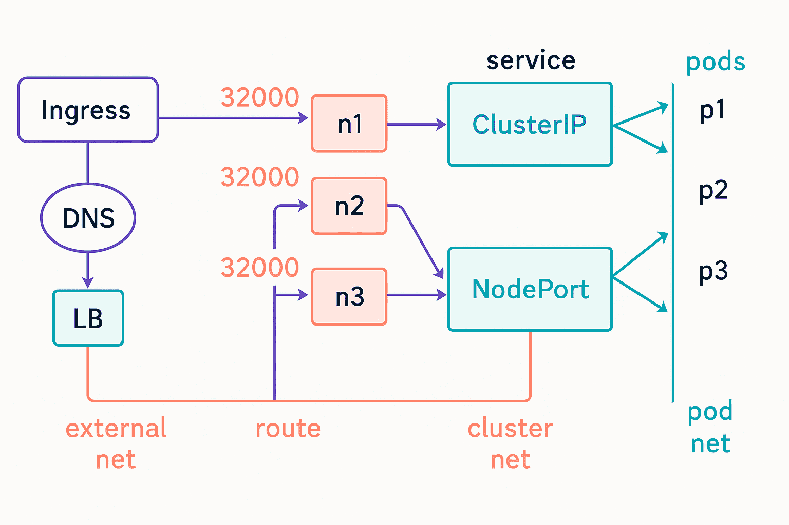

- [Kubernetes (K8S)](#kubernetes-k8s)
  - [📊 Container Orchestration Comparison Table](#-container-orchestration-comparison-table)
  - [Kubernetes was built for Backend Services](#kubernetes-was-built-for-backend-services)
    - [🖥️ Deploying Desktop Applications with Kubernetes](#️-deploying-desktop-applications-with-kubernetes)
    - [📱 Deploying Mobile Apps](#-deploying-mobile-apps)
- [Cloud-Native App vs 12-Factor App](#cloud-native-app-vs-12-factor-app)
  - [🌩 What “Cloud-Native” Means](#-what-cloud-native-means)
  - [🧱 About the 12-Factor Model](#-about-the-12-factor-model)
  - [🎯 So, What's Required?](#-so-whats-required)
- [🧮 Cloud-Native Approaches Comparison Table](#-cloud-native-approaches-comparison-table)
  - [🚀 Core Concepts/Main Objects](#-core-conceptsmain-objects)
  - [📦 Common Kubernetes Objects Summary](#-common-kubernetes-objects-summary)
  - [🧱 Kubernetes Pod vs Deployment – Comparison Table](#-kubernetes-pod-vs-deployment--comparison-table)
  - [| **Best Practice**        | Use for one-off or tightly controlled scenarios                         | Use for all scalable, resilient applications                                   |](#-best-practice---------use-for-one-off-or-tightly-controlled-scenarios--------------------------use-for-all-scalable-resilient-applications-----------------------------------)
    - [✅ Validity in Latest Kubernetes Version](#-validity-in-latest-kubernetes-version)
  - [🧮 Kubernetes Objects vs Resources Comparison](#-kubernetes-objects-vs-resources-comparison)
    - [🧠 Summary:](#-summary)
  - [📦 Kubernetes Component Summary](#-kubernetes-component-summary)
  - [⚙️ Kubernetes Capabilities](#️-kubernetes-capabilities)
  - [🧠 Philosophy](#-philosophy)
  - [🌍 Real-World Use Cases](#-real-world-use-cases)
  - [📦 Kubernetes Objects Summary Table](#-kubernetes-objects-summary-table)
  - [Note: Kubectl’s validation features](#note-kubectls-validation-features)
    - [✅ Built-in Validation Modes](#-built-in-validation-modes)
- [🧪 Vanilla Kubernetes vs Kubernetes Distributions – Comparison Table](#-vanilla-kubernetes-vs-kubernetes-distributions--comparison-table)
  - [✅ Validity in Latest Kubernetes Version](#-validity-in-latest-kubernetes-version-1)
- [Kustomize](#kustomize)
  - [🧩 What Is Kustomize?](#-what-is-kustomize)
  - [🚀 Why Use Kustomize?](#-why-use-kustomize)
  - [🔧 Kustomize Features Overview](#-kustomize-features-overview)
  - [📁 Typical Directory Structure](#-typical-directory-structure)
  - [⚙️ Kubernetes vs Istio Comparison Table](#️-kubernetes-vs-istio-comparison-table)
- [Ubuntu and Kubernetes](#ubuntu-and-kubernetes)
  - [🧪 Option 1: Minikube (Best for Beginners)](#-option-1-minikube-best-for-beginners)
    - [PROBLEM: `minikube start` errors](#problem-minikube-start-errors)
    - [SOLUTION: Uninstall and Re-Install Minikube](#solution-uninstall-and-re-install-minikube)
    - [Minikube and `docker system prune --all --force`](#minikube-and-docker-system-prune---all---force)
      - [⚠️ What the Command Does](#️-what-the-command-does)
      - [🧨 How It Affects Minikube](#-how-it-affects-minikube)
    - [Error caused by minikube when using Nordvpn](#error-caused-by-minikube-when-using-nordvpn)
      - [Explanation](#explanation)
      - [✅ How to Fix It](#-how-to-fix-it)
  - [🧰 Option 2: MicroK8s (Canonical’s Lightweight Kubernetes)](#-option-2-microk8s-canonicals-lightweight-kubernetes)
- [Minikube](#minikube)
  - [🚀 Minikube Main Commands Cheat Sheet](#-minikube-main-commands-cheat-sheet)
  - [Super command](#super-command)
- [🧰 kubectl Main Commands Cheat Sheet](#-kubectl-main-commands-cheat-sheet)
  - [⚔️ `kubectl create` vs `kubectl apply` – Comparison Table](#️-kubectl-create-vs-kubectl-apply--comparison-table)
    - [✅ Validity in Latest Kubernetes Version](#-validity-in-latest-kubernetes-version-2)
- [🧪 Kubernetes Certifications Comparison Table](#-kubernetes-certifications-comparison-table)
- [🧪 CNCF Certifications Beyond CKAD, CKA, CKS, and KCNA](#-cncf-certifications-beyond-ckad-cka-cks-and-kcna)
- [🧪 KCNA vs KCA Certification Comparison Table](#-kcna-vs-kca-certification-comparison-table)
  - [⚙️ Kubernetes vs Kyverno Comparison Table](#️-kubernetes-vs-kyverno-comparison-table)
- [🔐 CKS vs KCSA Certification Comparison Table](#-cks-vs-kcsa-certification-comparison-table)
- [Kubernetes Access Control](#kubernetes-access-control)
  - [🔐 Kubernetes Access Control Components](#-kubernetes-access-control-components)
  - [🧭 RBAC in Action](#-rbac-in-action)
  - [Common Kubernetes RBAC Roles \& Bindings](#common-kubernetes-rbac-roles--bindings)
    - [🔐 Popular Kubernetes RBAC Roles](#-popular-kubernetes-rbac-roles)
    - [📄 Example Role YAML: pod-reader](#-example-role-yaml-pod-reader)
    - [🔗 Example RoleBinding YAML](#-example-rolebinding-yaml)
    - [🧠 Best Practices](#-best-practices)
- [🧮 kubectl vs crictl Comparison Table](#-kubectl-vs-crictl-comparison-table)
  - [🧠 Summary:](#-summary-1)
- [🧪 `crictl` Cheat Sheet – Container Runtime Debugging CLI](#-crictl-cheat-sheet--container-runtime-debugging-cli)
  - [🔍 Pod Operations](#-pod-operations)
  - [📦 Container Operations](#-container-operations)
  - [🖼 Image Operations](#-image-operations)
  - [⚙️ Runtime \& Config](#️-runtime--config)
  - [🧠 **Tips**:](#-tips)
- [🌐 Kubernetes Networking Overview](#-kubernetes-networking-overview)
  - [✅ Networking Requirements in Kubernetes](#-networking-requirements-in-kubernetes)
  - [🧠 **Summary**:](#-summary-2)
- [Kubernetes Network Plugins](#kubernetes-network-plugins)
  - [🌐 Popular Kubernetes Network Plugins](#-popular-kubernetes-network-plugins)
  - [🧠 How They Work](#-how-they-work)
  - [🔌 How Kubernetes Handles Networking](#-how-kubernetes-handles-networking)
  - [Minikube and Network Plugins](#minikube-and-network-plugins)
    - [🧪 Check Active Network Plugin in Minikube](#-check-active-network-plugin-in-minikube)
      - [1. List Addons](#1-list-addons)
      - [2. Inspect CNI Config on Node](#2-inspect-cni-config-on-node)
      - [3. Check Running Pods in kube-system](#3-check-running-pods-in-kube-system)
      - [4. Check Node Runtime Info](#4-check-node-runtime-info)
- [Kubernetes YAML Required Fields](#kubernetes-yaml-required-fields)
  - [📘 Explanation of Kubernetes Commands](#-explanation-of-kubernetes-commands)
    - [🧠 Summary](#-summary-3)
  - [📘 Using `kubectl` for API Discovery](#-using-kubectl-for-api-discovery)
- [⚙️ What Is `kubectl autoscale`?](#️-what-is-kubectl-autoscale)
  - [🧰 Command Syntax](#-command-syntax)
  - [Example](#example)
  - [📋 Key Options](#-key-options)
  - [✅ Validity in Latest Kubernetes Version](#-validity-in-latest-kubernetes-version-3)
- [Kubernetes and Busybox](#kubernetes-and-busybox)
  - [Example](#example-1)
  - [🧠 Breakdown of the Command](#-breakdown-of-the-command)
  - [❌ What It Doesn’t Do](#-what-it-doesnt-do)
  - [✅ What You Might Want Instead](#-what-you-might-want-instead)
    - [1. Run a One-Time Job](#1-run-a-one-time-job)
    - [2. Create a Deployment That Runs a Shell](#2-create-a-deployment-that-runs-a-shell)
  - [🧪 Check What Was Created](#-check-what-was-created)
- [Managing Applications in Namespaces Demo](#managing-applications-in-namespaces-demo)
  - [🔧 Commands Used](#-commands-used)
  - [🧠 Purpose](#-purpose)
  - [Note `kubectl get all --all-namespaces`](#note-kubectl-get-all---all-namespaces)
  - [🧠 Comprehensive Command (All Namespaced Resources)](#-comprehensive-command-all-namespaced-resources)
    - [🔍 What It Does:](#-what-it-does)
  - [📊 Comparison: `default` vs `kube-system` Namespace](#-comparison-default-vs-kube-system-namespace)
  - [🧠 Summary](#-summary-4)
  - [✅ Aliases in `kubectl`](#-aliases-in-kubectl)
- [Scaling Applications Example](#scaling-applications-example)
- [Deployment Update \& Rollback Demo](#deployment-update--rollback-demo)
- [Label Management Demo](#label-management-demo)
- [🌐 Kubernetes Networking Flow Diagram](#-kubernetes-networking-flow-diagram)
  - [🧭 Key Components](#-key-components)
  - [🔄 Traffic Flow Summary](#-traffic-flow-summary)
  - [✅ Use Case](#-use-case)
- [🧭 Kubernetes Service Types Overview](#-kubernetes-service-types-overview)
  - [🔧 Service Types and Their Use Cases](#-service-types-and-their-use-cases)
  - [✅ Summary](#-summary-5)
- [Networking and Service Demo with Minikube - Manual Editing Example](#networking-and-service-demo-with-minikube---manual-editing-example)
- [Networking and Service Demo with Minikube - Automatic Example](#networking-and-service-demo-with-minikube---automatic-example)
  - [Deployment vs Service](#deployment-vs-service)
    - [🧠 Why You Need a Deployment First](#-why-you-need-a-deployment-first)
    - [❌ Why You Can’t Just Create a Service Alone](#-why-you-cant-just-create-a-service-alone)
- [Working with Ingress in Minikube](#working-with-ingress-in-minikube)
- [🌐 Comparison: NodePort vs Ingress](#-comparison-nodeport-vs-ingress)
- [Working with Port-Forwarding in Minikube](#working-with-port-forwarding-in-minikube)
# Kubernetes (K8S)
Kubernetes (often abbreviated as K8s) is an open-source platform designed to automate the deployment, scaling, and management of containerized applications2. Think of it as the operating system for your data center — orchestrating containers like a conductor leading an orchestra.
## 📊 Container Orchestration Comparison Table
| Feature                      | Docker Compose                         | Docker Swarm                          | Kubernetes                              |
|-----------------------------|----------------------------------------|---------------------------------------|------------------------------------------|
| 🚀 Purpose                   | Local multi-container development      | Basic container orchestration         | Advanced orchestration & scaling         |
| 🛠 Complexity                | Low                                     | Moderate                              | High                                      |
| 📦 Setup Time               | Minutes                                 | Few minutes                           | Hours (or use managed services)          |
| 🧩 Configuration Language   | YAML                                    | YAML + CLI                            | YAML + kubectl + many config types       |
| 🔁 Scaling Support          | Manual scale                            | Built-in scaling                      | Autoscaling, rolling updates             |
| 🧪 Health Checks            | Basic                                   | Supported                             | Robust, customizable                     |
| 🔌 Networking               | Simple bridge network                   | Overlay networks                      | Advanced networking model                |
| 🏗 Service Discovery        | Limited                                 | Built-in                              | DNS-based, automatic                     |
| 📦 Volume Management        | Simple                                  | Supported                             | Extensive with persistent volumes        |
| 🌐 Cloud Native Support     | Minimal                                 | Limited                               | Strong (cloud providers love it)         |
| 🧑‍🤝‍🧑 Community & Ecosystem | Small                                   | Niche                                  | Large, thriving ecosystem                |
| 📦 Use Case Example         | Dev/testing multi-service apps          | Small scale deployments               | Microservices at scale                   |
## Kubernetes was built for Backend Services
You use Kubernetes to host and manage the backend services: APIs, databases, authentication, push notification servers, etc.
### 🖥️ Deploying Desktop Applications with Kubernetes
- Uncommon setup: Desktop apps are typically designed to run with direct user interaction on a local device. Kubernetes is geared toward running services in a remote, headless environment—like servers.
- Workaround scenarios:
  - You can containerize parts of a desktop app (like its backend services or APIs) and run them on Kubernetes.
  - In some niche cases, people use Kubernetes to deploy virtual desktops or streamed apps using technologies like VNC or WebRTC—but that’s more specialized.
### 📱 Deploying Mobile Apps
- Not directly: You don’t deploy the mobile app itself with Kubernetes since it runs on a user’s smartphone. Instead:
  - You use Kubernetes to host and manage the backend services: APIs, databases, authentication, push notification servers, etc.
  - This allows your mobile app to interact with a scalable and resilient infrastructure.

💡 Think of Kubernetes as the backstage crew of a theater: it doesn’t perform on stage (your app on the user’s device), but it keeps the lights, sound, and props running flawlessly behind the scenes.


# Cloud-Native App vs 12-Factor App
While the 12-Factor App methodology is a popular set of guidelines for building scalable, maintainable cloud-native applications, it’s not a strict requirement. Being “cloud-native” is more about the architectural philosophy and deployment environment than adhering to a single methodology.
## 🌩 What “Cloud-Native” Means
Cloud-native applications are designed to fully leverage:
- Cloud infrastructure: such as dynamic provisioning, scaling, and high availability.
- Microservices architecture: breaking an app into independent services.
- Containerization: often using tools like Docker and orchestration platforms like Kubernetes.
- CI/CD pipelines: continuous integration and delivery for faster updates.
- DevOps culture: promoting collaboration between developers and operations.
## 🧱 About the 12-Factor Model
Originally created by Heroku, it outlines principles such as:
- Keeping codebase in version control
- Explicitly declaring and isolating dependencies
- Storing config in environment variables
- Treating logs as event streams ...and 8 more principles that encourage portability and robustness in app design.
## 🎯 So, What's Required?
- Many cloud-native apps do follow most of the 12-Factor principles because they align well with cloud-native goals.
- However, apps that adopt other models—like Service Mesh, Sidecar patterns, or newer philosophies like GitOps or serverless paradigms—can still be cloud-native without fitting neatly into the 12-Factor mold.
# 🧮 Cloud-Native Approaches Comparison Table
| Aspect                     | **12-Factor Model**                                      | **Service Mesh**                                         | **Sidecar Pattern**                                      | **GitOps**                                               | **Serverless**                                            |
|---------------------------|----------------------------------------------------------|----------------------------------------------------------|-----------------------------------------------------------|-----------------------------------------------------------|-----------------------------------------------------------|
| **Purpose**               | Application design principles for cloud readiness        | Networking layer to manage service communication          | Design pattern to split responsibilities in microservices | Infrastructure management through Git workflows           | Event-driven execution without managing servers           |
| **Primary Focus**         | Codebase structure, config, and runtime behavior         | Observability, reliability, security, and traffic control | Offloading common functionality from main container       | Declarative infrastructure & automation                   | Function-as-a-Service (FaaS) and auto-scaling             |
| **Typical Use Cases**     | SaaS apps, microservices                                  | Microservices communication (e.g., mTLS, retries)         | Logging, proxying, monitoring via helper container         | Deployment management, rollback, versioning               | Lightweight tasks, event handling, backend APIs           |
| **Key Tools**             | Heroku, Docker, CI/CD pipelines                           | Istio, Linkerd, Consul                                   | Envoy, sidecar containers in Kubernetes                    | Argo CD, Flux                                            | AWS Lambda, Azure Functions, Google Cloud Functions       |
| **State Management**      | Stateless preferred                                        | Works with stateful and stateless services                | Stateless helper containers                                | Declarative, stored in Git                               | Generally stateless                                       |
| **DevOps Integration**    | Strong alignment                                          | Complements DevOps                                       | Supports DevOps tasks                                     | Core to DevOps workflows                                 | Simplifies DevOps by abstracting ops                      |
| **Complexity Level**      | Moderate                                                  | High (complex mesh config)                                | Moderate (requires orchestration)                          | Moderate                                                  | Low to moderate (depends on architecture)                 |
| **Scalability Approach**  | Horizontal scaling                                        | Manages traffic between services                          | Helps individual services scale independently              | Git triggers infrastructure updates                      | Auto-scaling based on event triggers                      |
| **Deployment Environment**| Any cloud platform                                        | Kubernetes clusters                                       | Container orchestration platforms                          | Git-based CI/CD pipelines                                | Cloud platforms with FaaS support                         |

These approaches aren’t mutually exclusive—they often complement each other in modern architectures. For instance, you might use the 12-Factor model to design your app, deploy it using GitOps, run parts as serverless functions, and wrap services in sidecars within a service mesh.


## 🚀 Core Concepts/Main Objects
- Containers: Lightweight, portable units that package code and dependencies.
- Pods: The smallest deployable unit in Kubernetes, often wrapping one or more containers.
- Nodes: Machines (physical or virtual) that run your workloads.
- Cluster: A group of nodes managed together.
- Control Plane: The brain of Kubernetes, scheduling and managing workloads.
- Kubelet & Kube-proxy: Agents on nodes that ensure containers run and communicate properly.
## 📦 Common Kubernetes Objects Summary
| **Object**     | **Purpose**                                                                 |
|----------------|------------------------------------------------------------------------------|
| **Pod**        | The smallest unit in Kubernetes; manages one or more containers             |
| **Deployment** | Adds scalability and enables zero-downtime updates for applications         |
| **Service**    | Exposes workloads via a stable endpoint; provides a single access point     |
| **ConfigMap**  | Stores non-sensitive configuration data                                     |
| **Secret**     | Stores sensitive data like passwords, tokens, and keys                      |
## 🧱 Kubernetes Pod vs Deployment – Comparison Table
| **Aspect**               | **Pod**                                                                 | **Deployment**                                                                 |
|--------------------------|--------------------------------------------------------------------------|--------------------------------------------------------------------------------|
| **Definition**           | The smallest unit in Kubernetes; encapsulates one or more containers    | A higher-level object that manages Pods via ReplicaSets                        |
| **Lifecycle Management** | No built-in self-healing; must be manually recreated if it fails        | Automatically replaces failed Pods to maintain desired state                   |
| **Scalability**          | Not scalable on its own; must be manually duplicated                    | Supports scaling via `replicas` field                                          |
| **Updates**              | Manual updates; requires deleting and recreating                        | Supports rolling updates and rollbacks                                         |
| **Use Case**             | Ideal for testing, debugging, or short-lived tasks                      | Recommended for production workloads                                           |
| **Persistence**          | Ephemeral; not designed for long-term persistence                       | Persistent and resilient across node failures                                  |
| **Creation Method**      | `kubectl run` or `kubectl create -f pod.yaml`                           | `kubectl create deployment` or `kubectl apply -f deployment.yaml`             |
| **Controller Involved**  | None                                                                     | Uses ReplicaSet controller to manage Pods                                      |
| **Monitoring**           | No automatic monitoring                                                  | Continuously monitors and reconciles desired vs actual state                  |
| **Best Practice**        | Use for one-off or tightly controlled scenarios                         | Use for all scalable, resilient applications                                   |
---
### ✅ Validity in Latest Kubernetes Version
Both **Pod** and **Deployment** are fully supported and valid in the latest Kubernetes release (v1.33+). However, **Deployments are preferred** for most real-world applications due to their automation, scalability, and fault tolerance.
## 🧮 Kubernetes Objects vs Resources Comparison
| **Aspect**               | **Kubernetes Objects**                                                                 | **Kubernetes Resources**                                                                 |
|--------------------------|-----------------------------------------------------------------------------------------|-------------------------------------------------------------------------------------------|
| **Definition**           | Persistent entities that represent the desired and actual state of the cluster         | API endpoints used to access and manipulate Kubernetes objects                           |
| **Purpose**              | Describe what you want Kubernetes to manage (e.g., Pods, Services, Deployments)        | Provide RESTful access to collections of objects via HTTP verbs (GET, POST, etc.)        |
| **Format**               | Defined using YAML or JSON manifests with fields like `apiVersion`, `kind`, `spec`     | Represented as URLs in the Kubernetes API (e.g., `/api/v1/pods`)                         |
| **Examples**             | Pod, Deployment, Service, ConfigMap, Secret                                             | `/api/v1/pods`, `/apis/apps/v1/deployments`, `/api/v1/namespaces`                        |
| **Interaction**          | Created and managed via `kubectl` or client libraries                                  | Accessed via Kubernetes API server using HTTP requests                                   |
| **Persistence**          | Stored in `etcd` as records of intent                                                   | Resources are the interfaces to retrieve or modify those records                         |
| **Relationship**         | Objects are the data entities                                                          | Resources are the API paths used to interact with those entities                         |
| **Custom Extensions**    | Can be extended via Custom Resource Definitions (CRDs)                                  | Custom resources create new API endpoints for custom objects                             |
### 🧠 Summary:
- Objects are the what — the actual entities you define and manage.
- Resources are the how — the API interfaces through which you interact with those entities.


## 📦 Kubernetes Component Summary
| **Component**              | **Role & Function**                                                                 |
|---------------------------|-------------------------------------------------------------------------------------|
| **kube-apiserver**        | Validates API objects and serves as Kubernetes’ front-end                          |
| **etcd**                  | Key-value store for all cluster state and resources                                |
| **kube-scheduler**        | Assigns newly created pods to nodes based on resource availability and policies    |
| **kube-controller-manager** | Runs background processes that regulate cluster state                             |
| **cloud-controller-manager** | Integrates Kubernetes with cloud provider APIs                                  |
| **container runtime**     | Executes container workloads within nodes                                          |
| **kubelet**               | Agent on each node that ensures containers are running as instructed               |


## ⚙️ Kubernetes Capabilities
| Capability             | Description                                                                 |
|------------------------|-----------------------------------------------------------------------------|
| **Deployment Automation** | Launches and manages containers across clusters                           |
| **Self-Healing**          | Restarts failed containers, replaces unhealthy ones                       |
| **Scaling**               | Automatically adjusts resources based on demand                           |
| **Load Balancing**        | Distributes traffic across containers for stability                       |
| **Rollouts & Rollbacks**  | Updates apps with zero downtime and reverts if needed                     |
| **Storage Orchestration** | Mounts local or cloud storage as needed                                   |
| **Secret Management**     | Securely stores sensitive data like passwords and tokens                  |
## 🧠 Philosophy
Kubernetes uses a declarative model: you define your desired state (e.g., 5 replicas of an app), and Kubernetes continuously works to make reality match that state.
## 🌍 Real-World Use Cases
- E-commerce platforms handling millions of users
- Media streaming with global content delivery
- Financial services requiring secure, scalable infrastructure
- Healthcare systems managing patient data and analytics
## 📦 Kubernetes Objects Summary Table
| Object Type       | Purpose / Role                                      | Typical Use Case                            |
|-------------------|-----------------------------------------------------|---------------------------------------------|
| **Pod**           | Smallest deployable unit; wraps one or more containers | Running a single app or tightly coupled containers |
| **Deployment**    | Manages stateless Pods with rolling updates         | Web apps, APIs, frontend services           |
| **ReplicaSet**    | Ensures a specified number of Pod replicas          | Used internally by Deployments              |
| **StatefulSet**   | Manages stateful Pods with persistent identity      | Databases, queues, apps needing stable storage |
| **DaemonSet**     | Ensures one Pod per node                            | Monitoring agents, log collectors           |
| **Job**           | Runs a task to completion                           | Batch jobs, data processing                 |
| **CronJob**       | Runs Jobs on a schedule                             | Backups, scheduled tasks                    |
| **Service**       | Exposes Pods via stable networking                  | Internal/external access to apps            |
| **Ingress**       | Manages external HTTP/S access to Services          | Routing traffic, SSL termination            |
| **ConfigMap**     | Stores non-sensitive config data                    | App settings, environment variables         |
| **Secret**        | Stores sensitive data securely                      | Passwords, tokens, certificates             |
| **PersistentVolume (PV)** | Represents physical storage                  | Disk, NFS, cloud storage                    |
| **PersistentVolumeClaim (PVC)** | Requests storage from PVs             | Attaching storage to Pods                   |
| **Namespace**     | Logical cluster partitioning                        | Multi-team, multi-env isolation             |
| **ServiceAccount**| Provides identity for Pods                          | Access control, API authentication          |
| **ResourceQuota** | Limits resource usage per namespace                 | Preventing overconsumption                  |
| **LimitRange**    | Sets default/request/limit values for resources     | Enforcing resource boundaries               |
## Note: Kubectl’s validation features
help developers catch errors in Kubernetes manifests before applying them to a cluster. These features are essential for maintaining clean, reliable configurations. Here's a breakdown of what they include:
### ✅ Built-in Validation Modes
| Mode              | Description                                                               |
|-------------------|---------------------------------------------------------------------------|
| `--dry-run=client`| Validates syntax locally without contacting the API server               |
| `--dry-run=server`| Sends the manifest to the API server for full validation (schema + logic)|
| `kubectl diff`    | Compares live resources with local manifests to preview changes          |


# 🧪 Vanilla Kubernetes vs Kubernetes Distributions – Comparison Table
| **Aspect**               | **Vanilla Kubernetes**                                                  | **Kubernetes Distribution**                                                   |
|--------------------------|-------------------------------------------------------------------------|--------------------------------------------------------------------------------|
| **Definition**           | Pure upstream Kubernetes from the official source                       | Vendor-customized Kubernetes with added tools and integrations                |
| **Setup Complexity**     | Requires manual setup and configuration                                 | Pre-configured and easier to deploy                                           |
| **Flexibility**          | Fully customizable; no vendor lock-in                                   | May include proprietary components or opinionated defaults                    |
| **Maintenance**          | User is responsible for updates, patches, and lifecycle management      | Vendor often provides automated updates and support                          |
| **Tooling & Add-ons**    | Must be manually integrated (e.g., monitoring, logging, networking)     | Often bundled with built-in tools and enterprise features                     |
| **Support**              | Community-driven support via forums and GitHub                          | Commercial support from vendor                                                |
| **Use Case**             | Ideal for learning, experimentation, or custom production setups        | Ideal for enterprise production environments needing reliability and support  |
| **Examples**             | Minikube, kubeadm, kind                                                  | Red Hat OpenShift, Rancher, GKE, EKS, AKS, VMware Tanzu                       |
| **Cost**                 | Free and open source                                                     | May involve licensing or support fees                                         |
| **Upstream Compatibility**| Always aligned with latest Kubernetes releases                          | May lag behind upstream or include forks                                      |
## ✅ Validity in Latest Kubernetes Version
Both **Vanilla Kubernetes** and **Kubernetes Distributions** are valid and widely used in the latest Kubernetes versions (v1.33+). The choice depends on your needs:
- Use **vanilla** for full control and learning.
- Use a **distribution** for enterprise-grade features and support.

Want help choosing a distribution or setting up a vanilla cluster with production-grade tooling?


# Kustomize 
Kustomize is a powerful configuration management tool built specifically for Kubernetes — and the best part? It’s template-free and fully declarative, meaning you work directly with YAML files without introducing a new templating language.
## 🧩 What Is Kustomize?
Kustomize lets you customize Kubernetes manifests without modifying the original files. Instead of duplicating YAML for each environment (like dev, staging, prod), you define a base and apply overlays to patch or transform it.
## 🚀 Why Use Kustomize?
- Environment-specific configs without duplicating YAML
- GitOps-friendly: declarative and version-controlled
- Works with Helm: patch Helm-generated manifests
- Integrated into CI/CD pipelines for clean deployments
## 🔧 Kustomize Features Overview
| Feature             | Description                                                            |
|---------------------|------------------------------------------------------------------------|
| Base & Overlays     | Reuse common configs and layer environment-specific changes            |
| Transformers        | Add labels, annotations, prefixes, suffixes, namespaces                |
| Generators          | Create ConfigMaps and Secrets from files or literals                   |
| Patching            | Modify resources using strategic merge or JSON patches                 |
| Built into kubectl  | Use `kubectl apply -k` to apply Kustomize configs directly             |
| No Templating       | Works with plain YAML — no need for Helm-style templates               |
## 📁 Typical Directory Structure
```shell
my-app/
├── base/
│   ├── deployment.yaml
│   ├── service.yaml
│   └── kustomization.yaml
└── overlays/
    ├── dev/
    │   └── kustomization.yaml (patches, transformers)
    └── prod/
        └── kustomization.yaml (patches, transformers)
```
## ⚙️ Kubernetes vs Istio Comparison Table
| Feature                     | Kubernetes                                      | Istio                                                  |
|----------------------------|--------------------------------------------------|--------------------------------------------------------|
| 🎯 Primary Role            | Container orchestration platform                | Service mesh for microservice communication            |
| 🧠 Core Functionality      | Deploying, scaling, and managing containers     | Traffic management, security, observability            |
| 🔌 Networking              | Basic service discovery, DNS, load balancing    | Advanced routing, retries, fault injection, mTLS       |
| 🔐 Security Capabilities   | RBAC, Network Policies, Secrets                 | Zero-trust security, mTLS, access control policies     |
| 📦 Configuration Style     | Declarative YAML manifests                      | Declarative YAML policies (VirtualService, DestinationRule) |
| 🔄 Automation              | Self-healing, autoscaling, rolling updates      | Canary deployments, traffic shifting, circuit breaking |
| 📊 Observability           | Basic metrics via Prometheus, logging via Fluentd | Built-in telemetry, tracing, logging integrations      |
| 🧩 Integration             | Works with Helm, Argo, Prometheus, etc.         | Integrates with Envoy, Prometheus, Grafana, Zipkin     |
| 🧑‍🤝‍🧑 Community & Ecosystem | Massive CNCF ecosystem                          | CNCF graduated project with growing adoption           |
| 🧪 Use Case Example        | Running containerized apps at scale             | Managing secure, observable microservice traffic       |


# Ubuntu and Kubernetes
## 🧪 Option 1: Minikube (Best for Beginners)
```shell
###############################################################################
# CHECK PRE-REQUISITES
###############################################################################
# 0. Verify that docker is installed (and nothing else)
which docker
which minikube
which kubectl
# 0. Validate that the 'docker' group exist
getent group | grep -i docker
# 0. Validate that your Linux user is part of 'docker' group
whoami
groups
# if NOT, go back to 
# 'Container_Docker_Notes.md#how-to-install-docker-on-ubuntu'
# 0. Start with a clean state
## List all docker objects
echo "================================================== CONTAINERS" && \
docker container ls --all && \
echo "================================================== IMAGES" && \
docker image ls --all && \
echo "================================================== NETWORKS" && \
docker network ls && \
echo "================================================== VOLUMES" && \
docker volume ls
## if there is at least 1 container running, the following command is best:
echo "================================================== Stopping all running containers" && \
docker stop $(docker ps -q) && \
echo "================================================== Removing all containers" && \
docker rm $(docker ps -aq) && \
echo "================================================== Removing all images (except minikube)" && \
MINIKUBE_IMAGE_ID=$(docker images --format "{{.Repository}} {{.ID}}" | grep "gcr.io/k8s-minikube/kicbase" | awk '{print $2}')
docker images -q | grep -v "$MINIKUBE_IMAGE_ID" | xargs -r docker rmi && \
echo "================================================== Removing all networks" && \
docker network prune --force && \
echo "================================================== Removing all volumes" && \
docker volume prune --force


###############################################################################
# MINIKUBE INSTALLATION
###############################################################################
# Install dependencies
cd ~ && sudo apt update --yes

# Install Minikube
hostnamectl | grep -i architecture

curl -LO https://github.com/kubernetes/minikube/releases/latest/download/minikube-linux-amd64

ls -la | grep -i minikube
# if you see '.minikube', follow the steps for uninstalling minikube in "Container_0_Notes.md#2--uninstall-minikube" before continuing again

sudo install minikube-linux-amd64 /usr/local/bin/minikube && rm minikube-linux-amd64

# Validate that minikube is working
which minikube && minikube status

: <<'PLEASE_MAKE_SURE_YOUR_LINUX_USER_IS_PART_OF_DOCKER_GROUP'
# 🛠️ Fix: Enable Docker Driver for your user
whoami
groups
docker --version
getent group | grep -i docker
sudo groupadd docker
sudo usermod -aG docker $USER && newgrp docker
whoami
groups
# Without "sudo usermod -aG docker $USER && newgrp docker", you will get:
# 💣  Exiting due to PROVIDER_DOCKER_NEWGRP: "docker version --format <no value>-<no value>:<no value>" exit status 1: permission denied while trying to connect to the Docker daemon socket at unix:///var/run/docker.sock: Get "http://%2Fvar%2Frun%2Fdocker.sock/v1.51/version": dial unix /var/run/docker.sock: connect: permission denied
#
# 1. sudo usermod -aG docker $USER
# This part adds your current user ($USER) to the docker group.
# Why? Because Docker’s daemon (dockerd) requires group membership for permission to run Docker commands without sudo.
#
# 2. newgrp docker
# This activates your membership in the docker group immediately in the current shell session.
# Otherwise, you’d need to log out and log back in for the group change to take effect.
#
# After running "sudo usermod -aG docker $USER && newgrp docker":
# You should be able to use Docker commands like docker ps or docker images without prefixing them with sudo.
# This is important for tools like Minikube, which rely on Docker being accessible to your user.
#
# 🧠 How to Make It Stick
# To avoid having to rerun "newgrp docker" every time. exit the subshell:
exit
whoami
groups
# 1. Log out completely from your desktop or terminal session.
# echo $XDG_CURRENT_DESKTOP
# gnome-session-quit --logout --no-prompt
sudo reboot
# 2. Log back in — this refreshes your group memberships.
# Run:
whoami
groups
PLEASE_MAKE_SURE_YOUR_LINUX_USER_IS_PART_OF_DOCKER_GROUP

# Start your cluster
minikube start --driver=docker

# Minikube internal tool
minikube kubectl -- get pods --all-namespaces

# 🧹 Step-by-Step Cleanup Guide for Minikube
# This removes the entire cluster and all associated resources:
echo "================================================================================ RUNNING minikube stop" && \
minikube stop && \
echo "================================================================================ RUNNING minikube delete" && \
minikube delete --all --purge && \
echo "================================================================================ RUNNING minikube status" && \
minikube status
# --all: Deletes all Minikube profiles.
# --purge: Removes the .minikube folder from your home directory.

###############################################################################
# Download and install kubectl
###############################################################################
# Solution 1 - SNAP
# ✅ Pros: Fast, simple, auto-updates 
# ⚠️ Cons: May not always be the latest version
sudo apt update
sudo apt install snapd -y
sudo snap install kubectl --classic


# Solution 2 - APT (BETTER SOLUTION)
# Create keyrings directory if it doesn't exist
cd ~
sudo mkdir -p /etc/apt/keyrings
# Download and store the GPG key
curl -fsSL https://pkgs.k8s.io/core:/stable:/v1.29/deb/Release.key | \
  sudo gpg --dearmor -o /etc/apt/keyrings/kubernetes-apt-keyring.gpg
# Add the new Kubernetes APT repository
echo "deb [signed-by=/etc/apt/keyrings/kubernetes-apt-keyring.gpg] \
  https://pkgs.k8s.io/core:/stable:/v1.29/deb/ /" | \
  sudo tee /etc/apt/sources.list.d/kubernetes.list
# Update and install kubectl
sudo apt update
sudo apt install --yes kubectl

# Test
echo "================================================================================ CHECK all tools" && \
which docker && which minikube && which kubectl && \
echo "================================================================================ RUNNING minikube status" && \
minikube status && \
echo "================================================================================ RUNNING minikube kubectl" && \
minikube kubectl -- get pods --all-namespaces && \
echo "================================================================================ RUNNING kubectl" && \
kubectl get pods --all-namespaces
```
Sources:
- https://minikube.sigs.k8s.io/docs/start
- https://github.com/sandervanvugt/kubernetes/blob/master/minikube-docker-setup.sh

✅ Pros: Easy setup, low resource usage

⚠️ Cons: Not production-grade, limited to one node
### PROBLEM: `minikube start` errors
If you get:
```shell
❗  Enabling 'storage-provisioner' returned an error: running callbacks: [sudo KUBECONFIG=/var/lib/minikube/kubeconfig /var/lib/minikube/binaries/v1.33.1/kubectl apply --force -f /etc/kubernetes/addons/storage-provisioner.yaml: Process exited with status 1
stdout:

stderr:
error: error validating "/etc/kubernetes/addons/storage-provisioner.yaml": error validating data: failed to download openapi: Get "https://localhost:8443/openapi/v2?timeout=32s": dial tcp [::1]:8443: connect: connection refused; if you choose to ignore these errors, turn validation off with --validate=false
]
❗  Enabling 'default-storageclass' returned an error: running callbacks: [sudo KUBECONFIG=/var/lib/minikube/kubeconfig /var/lib/minikube/binaries/v1.33.1/kubectl apply --force -f /etc/kubernetes/addons/storageclass.yaml: Process exited with status 1
stdout:

stderr:
error: error validating "/etc/kubernetes/addons/storageclass.yaml": error validating data: failed to download openapi: Get "https://localhost:8443/openapi/v2?timeout=32s": dial tcp [::1]:8443: connect: connection refused; if you choose to ignore these errors, turn validation off with --validate=false
```
### SOLUTION: Uninstall and Re-Install Minikube
See:
- Container_0_Notes.md#1-verify-what-is-installed
### Minikube and `docker system prune --all --force`
```shell
echo "================================================== Docker system cleanup" && \
docker system prune --all --force
```
#### ⚠️ What the Command Does
This command removes:
- All stopped containers
- All unused images (even those not dangling)
- All unused networks
- All build cache

If you add --volumes, it also removes anonymous volumes, which may contain persistent data.
#### 🧨 How It Affects Minikube
If Minikube is using Docker as its container runtime (via --driver=docker), then:
- The Minikube VM itself is a Docker container.
- Pruning aggressively may remove images used by Minikube workloads.
- It can also remove networks or volumes Minikube depends on.

In some cases, users have reported needing to restart or recreate the Minikube cluster after pruning.


### Error caused by minikube when using Nordvpn
When you run:
```shell
nordvpn status
```
you will see:
```shell
update.go:85: cannot change mount namespace according to change mount (/run/user/1000/doc/by-app/snap.nordvpn /run/user/1000/doc none bind,rw,x-snapd.ignore-missing 0 0): cannot inspect "/run/user/1000/doc": lstat /run/user/1000/doc: permission denie
```
#### Explanation
```shell
You: 
1. Added your user to the docker group (good!)
2. Started a new shell session with docker as your primary group (temporary)

This new shell session can alter environment variables and session paths, which Snap-based apps like NordVPN rely on. That’s why you saw the error involving /run/user/1000/doc — Snap couldn’t access your user’s document portal due to permission mismatches in the new shell.
```
#### ✅ How to Fix It
1. Exit the newgrp shell Just type exit to return to your original shell.
2. Log out and log back in This ensures your group membership is fully applied across your session.
3. Restart Snapd (optional)
```shell
sudo systemctl restart snapd
```
4. Try NordVPN again Run:
```shell
nordvpn status
```
## 🧰 Option 2: MicroK8s (Canonical’s Lightweight Kubernetes)
```shell
# Install MicroK8s
sudo snap install microk8s --classic

# Add your user to the MicroK8s group
sudo usermod -a -G microk8s $USER
newgrp microk8s

# Enable common add-ons
microk8s enable dns dashboard storage

# Check cluster status
microk8s status --wait-ready
```
✅ Pros: Fast, modular, supports multi-node

⚠️ Cons: Snap-based, may need extra config for networking
# Minikube
## 🚀 Minikube Main Commands Cheat Sheet
| Command                            | Purpose                                                   |
|------------------------------------|-----------------------------------------------------------|
| `minikube start`                   | Launches a local Kubernetes cluster                       |
| `minikube stop`                    | Stops the running cluster                                 |
| `minikube delete`                 | Deletes the cluster and its configuration                 |
| `minikube status`                  | Displays current cluster status                           |
| `minikube dashboard`              | Opens the Kubernetes dashboard in your browser            |
| `minikube addons list`            | Lists available add-ons                                   |
| `minikube addons enable <name>`   | Enables a specific add-on                                 |
| `minikube addons disable <name>`  | Disables a specific add-on                                |
| `minikube service <svc-name>`     | Opens a service in your browser                           |
| `minikube ip`                      | Shows the cluster’s IP address                            |
| `minikube logs`                    | Displays cluster logs for troubleshooting                 |
| `minikube config view`            | Shows current configuration settings                      |
| `minikube update-check`           | Checks for Minikube updates                               |
| `minikube ssh`                     | SSH into the Minikube VM/container which will allow you to use ``crictl``|
## Super command
```shell
minikube start --driver=docker --cpus=4 --memory=8192 --disk-size=10g
# Check cpu count with 'lscpu'
# Check memory with 'free -h'
# Check disk space with 'df -h'
```


# 🧰 kubectl Main Commands Cheat Sheet
| Command                            | Purpose                                                   |
|------------------------------------|-----------------------------------------------------------|
| `kubectl get <resource>`           | List resources (pods, services, deployments, etc.)        |
| `kubectl describe <resource>`      | Show detailed info about a resource                       |
| `kubectl apply -f <file>`          | Create or update resources from a YAML/JSON file          |
| `kubectl create <resource>`        | Create a resource manually                                |
| `kubectl delete <resource>`        | Delete a resource                                         |
| `kubectl edit <resource>`          | Edit a resource in your default editor                    |
| `kubectl logs <pod>`               | View logs from a pod                                      |
| `kubectl exec <pod> -- <cmd>`      | Run a command inside a pod                                |
| `kubectl port-forward <pod/service>`| Forward local port to pod/service                         |
| `kubectl scale <resource>`         | Scale a deployment or replicaset                          |
| `kubectl rollout <subcommand>`     | Manage deployment rollouts (status, undo, restart)        |
| `kubectl top <resource>`           | View resource usage (CPU/memory)                          |
| `kubectl config <subcommand>`      | Manage kubeconfig contexts and clusters                   |
| `kubectl get all`                  | List all resources in the current namespace               |
## ⚔️ `kubectl create` vs `kubectl apply` – Comparison Table
| **Aspect**                  | **`kubectl create`**                                               | **`kubectl apply`**                                                |
|-----------------------------|---------------------------------------------------------------------|---------------------------------------------------------------------|
| **Command Type**            | Imperative                                                         | Declarative                                                         |
| **Primary Use**             | Create new resources                                               | Create or update resources                                          |
| **Behavior if Resource Exists** | Errors out (`AlreadyExists`)                                      | Updates the existing resource                                       |
| **Update Capability**       | Cannot update existing resources                                   | Can update existing resources based on changes in config            |
| **Input Format**            | YAML or JSON                                                       | YAML or JSON                                                        |
| **Version Control Friendly**| ❌ Not ideal for GitOps workflows                                   | ✅ Ideal for GitOps and CI/CD pipelines                             |
| **Partial Config Support**  | Requires full resource definition                                  | Supports partial updates                                            |
| **Annotation Tracking**     | Does not track last applied configuration unless `--save-config`  | Automatically tracks last applied configuration                    |
| **Typical Use Case**        | Quick creation, experimentation                                    | Production deployments, config drift management                    |
| **Error Handling**          | Fails if resource exists                                           | Applies changes safely and incrementally                           |
### ✅ Validity in Latest Kubernetes Version
Both `kubectl create` and `kubectl apply` are **fully supported** and **stable** in the latest Kubernetes releases (v1.33+). They serve different purposes and are often used together in real-world workflows.


# 🧪 Kubernetes Certifications Comparison Table
| Feature                     | KCNA (Associate)                  | CKAD (App Developer)             | CKA (Administrator)               | CKS (Security Specialist)            |
|----------------------------|-----------------------------------|----------------------------------|-----------------------------------|--------------------------------------|
| 🎯 Primary Focus           | Foundational Kubernetes & Cloud Native | App development & deployment     | Cluster operations & maintenance  | Securing Kubernetes environments     |
| 👤 Target Audience         | Beginners, students, career switchers | Developers                       | Sysadmins / DevOps Engineers      | Security Engineers / Advanced Admins |
| 🔧 Key Skills              | Concepts, kubectl basics, ecosystem | Deployments, Services, Configs   | Cluster setup, networking, storage| RBAC, secrets, runtime protection    |
| 📋 Exam Format             | Multiple-choice, online           | Hands-on, CLI-based              | Hands-on, CLI-based               | Hands-on, CLI-based                  |
| ⏱ Duration                | 90 minutes                        | 2 hours                          | 2 hours                           | 2 hours                              |
| 🧑‍💻 Prerequisites          | None                              | None                             | None                              | Must hold valid CKA certification    |
| 🏆 Difficulty Level        | Entry-level                       | Beginner to Intermediate         | Intermediate to Advanced          | Advanced                             |
| 🎓 Credential Validity     | 2 years                           | 3 years                          | 3 years                           | 2 years                              |
| 📚 Learning Focus          | Cloud native principles, Kubernetes basics | Kubernetes primitives, apps      | Cluster architecture, ops         | Threat modeling, hardening, policies |
| 🧑‍🤝‍🧑 Community Recognition  | Growing                           | High                             | Very High                          | Highly Specialized                   |
# 🧪 CNCF Certifications Beyond CKAD, CKA, CKS, and KCNA
| Certification                        | Focus Area                          | Ideal For                              |
|-------------------------------------|-------------------------------------|----------------------------------------|
| **KCSA** – Kubernetes & Cloud Security Associate | Foundational cloud-native security | Beginners interested in security       |
| **PCA** – Prometheus Certified Associate        | Monitoring & observability         | Devs & SREs working with metrics       |
| **ICA** – Istio Certified Associate             | Service mesh fundamentals           | Engineers using Istio for traffic mgmt |
| **CCA** – Cilium Certified Associate            | Networking & observability          | Platform engineers, cloud specialists  |
| **CAPA** – Certified Argo Project Associate     | Argo ecosystem (Workflows, CD)     | DevOps, data scientists                |
| **CGOA** – GitOps Certified Associate           | GitOps principles & practices       | CI/CD practitioners, platform teams    |
| **CBA** – Certified Backstage Associate         | Internal developer platforms       | Engineers building IDPs                |
| **OTCA** – OpenTelemetry Certified Associate    | Telemetry, tracing, logging        | Observability-focused professionals    |
| **KCA** – Kyverno Certified Associate           | Kubernetes policy management        | Security & compliance engineers        |
| **CNPA** – Cloud Native Platform Engineering Associate | Platform engineering fundamentals | Early-career platform engineers        |
# 🧪 KCNA vs KCA Certification Comparison Table
| Feature                     | KCNA (Kubernetes & Cloud Native Associate) | KCA (Kyverno Certified Associate)         |
|----------------------------|--------------------------------------------|-------------------------------------------|
| 🎯 Primary Focus           | Foundational Kubernetes & cloud-native concepts | Kubernetes policy management with Kyverno |
| 👤 Target Audience         | Beginners, students, career switchers      | Kubernetes admins, DevSecOps, security engineers |
| 🔧 Key Skills              | Kubernetes basics, cloud-native ecosystem  | Writing, applying, and managing Kyverno policies |
| 📋 Exam Format             | Multiple-choice, online                    | Multiple-choice, online                    |
| ⏱ Duration                | 90 minutes                                 | 90 minutes                                 |
| 🧑‍💻 Prerequisites          | None                                       | Familiarity with Kubernetes recommended    |
| 🏆 Difficulty Level        | Entry-level                                | Intermediate                               |
| 🎓 Credential Validity     | 2 years                                    | 2 years                                    |
| 📚 Learning Focus          | kubectl, containers, observability, architecture | Kyverno CLI, policy writing, security enforcement |
| 🧑‍🤝‍🧑 Community Recognition  | Growing                                    | Niche but rising in cloud security circles |
## ⚙️ Kubernetes vs Kyverno Comparison Table
| Feature                     | Kubernetes                                      | Kyverno                                              |
|----------------------------|--------------------------------------------------|------------------------------------------------------|
| 🎯 Primary Role            | Container orchestration platform                | Kubernetes-native policy engine                      |
| 🧠 Core Functionality      | Deploying, scaling, and managing containers     | Validating, mutating, generating, and verifying resources |
| 🛠 Configuration Style     | Declarative YAML manifests                      | Declarative YAML policies (no new language needed)   |
| 🔐 Security Capabilities   | RBAC, Network Policies, Secrets                 | Enforces security policies, image verification, PSPs |
| 🧪 Policy Enforcement      | Basic via admission controllers                 | Advanced via dynamic admission control               |
| 🔄 Automation              | Self-healing, autoscaling, rolling updates      | Auto-labeling, just-in-time provisioning, cleanup    |
| 📦 Resource Scope          | Pods, Services, Deployments, etc.               | All Kubernetes resources, including CRDs             |
| 📋 Reporting               | Limited built-in reporting                      | Policy reports, audit logs, compliance tracking      |
| 🧑‍🤝‍🧑 Community & Ecosystem | Massive CNCF ecosystem                          | CNCF incubating project with growing adoption        |
| 🧩 Integration             | Works with tools like Helm, Argo, Prometheus    | Integrates with Cosign, Sixty, Chainsaw, GitOps tools |
# 🔐 CKS vs KCSA Certification Comparison Table
| Feature                     | CKS (Certified Kubernetes Security Specialist) | KCSA (Kubernetes & Cloud Native Security Associate) |
|----------------------------|------------------------------------------------|-----------------------------------------------------|
| 🎯 Primary Focus           | Securing Kubernetes clusters & workloads       | Foundational cloud-native & Kubernetes security     |
| 👤 Target Audience         | Experienced Kubernetes admins & security pros  | Beginners, career switchers, aspiring security engineers |
| 🔧 Key Skills              | RBAC, network policies, runtime protection, supply chain security | Cluster hardening, threat modeling, compliance frameworks |
| 📋 Exam Format             | Hands-on, CLI-based                            | Multiple-choice, online                             |
| ⏱ Duration                | 2 hours                                        | 90 minutes                                          |
| 🧑‍💻 Prerequisites          | Valid CKA certification                        | None                                                |
| 🏆 Difficulty Level        | Advanced                                       | Entry-level to intermediate                         |
| 🎓 Credential Validity     | 2 years                                        | 2 years                                             |
| 📚 Learning Focus          | Real-world security scenarios, mitigation tools | Security fundamentals, best practices, frameworks   |
| 🧑‍🤝‍🧑 Community Recognition  | High (industry standard for Kubernetes security) | Growing (newer cert with rising relevance)          |


# Kubernetes Access Control
## 🔐 Kubernetes Access Control Components
| **Component**                        | **Function**                                                                 |
|-------------------------------------|------------------------------------------------------------------------------|
| **Authentication**                  | Verifies the identity of users or services (e.g., via certificates, tokens) |
| **Authorization**                   | Determines what authenticated entities are allowed to do                    |
| **RBAC (Role-Based Access Control)**| Grants permissions based on roles assigned to users or groups               |
| **ABAC (Attribute-Based Access Control)** | Uses user attributes and policies for fine-grained access control     |
| **Service Accounts**                | Special accounts for pods to interact with the Kubernetes API               |
| **Network Policies**                | Control pod-to-pod communication and traffic flow                           |
| **Pod Security Policies**           | Define security constraints for pod deployment                              |
| **Audit Logging**                   | Tracks access and changes for monitoring and compliance                     |
## 🧭 RBAC in Action
RBAC is the most commonly used method in Kubernetes. It involves:
- Roles: Define what actions (verbs like get, list, create) can be performed on which resources (pods, services, etc.)
- RoleBindings: Assign roles to users or service accounts within a namespace
- ClusterRoles: Like Roles, but apply across the entire cluster
- ClusterRoleBindings: Bind ClusterRoles to users or groups cluster-wide

This lets you enforce the principle of least privilege, ensuring users only have access to what they need.
## Common Kubernetes RBAC Roles & Bindings
### 🔐 Popular Kubernetes RBAC Roles
| **RBAC Role**             | **Purpose**                                                                 |
|---------------------------|------------------------------------------------------------------------------|
| **cluster-admin**         | Full access to all resources across the cluster (use sparingly!)            |
| **admin**                 | Full access within a namespace, including managing roles and bindings       |
| **edit**                  | Can create, update, delete most resources in a namespace (except RBAC)      |
| **view**                  | Read-only access to resources in a namespace                                |
| **pod-reader**            | Custom role to allow viewing pods (`get`, `list`, `watch`)                  |
| **secret-reader**         | Grants access to view secrets (often used with monitoring tools)            |
| **deployment-manager**    | Allows managing deployments, pods, services, etc.                           |
| **metrics-collector**     | Read-only access to metrics APIs across namespaces                          |
### 📄 Example Role YAML: pod-reader
```yaml
apiVersion: rbac.authorization.k8s.io/v1
kind: Role
metadata:
  namespace: dev
  name: pod-reader
rules:
- apiGroups: [""]
  resources: ["pods"]
  verbs: ["get", "list", "watch"]
```
### 🔗 Example RoleBinding YAML
```yaml
apiVersion: rbac.authorization.k8s.io/v1
kind: RoleBinding
metadata:
  name: read-pods
  namespace: dev
subjects:
- kind: User
  name: arthur
  apiGroup: rbac.authorization.k8s.io
roleRef:
  kind: Role
  name: pod-reader
  apiGroup: rbac.authorization.k8s.io
```
### 🧠 Best Practices
- Use RoleBindings for namespace-scoped access and ClusterRoleBindings for cluster-wide access.
- Prefer least privilege: grant only the permissions needed.
- Regularly audit RBAC policies to avoid privilege creep.
- Use groups to simplify access management across teams.


# 🧮 kubectl vs crictl Comparison Table
| **Aspect**               | **kubectl**                                                  | **crictl**                                                   |
|--------------------------|--------------------------------------------------------------|---------------------------------------------------------------|
| **Purpose**              | Interacts with the Kubernetes API server                     | Interacts directly with container runtimes via CRI            |
| **Scope**                | Cluster-wide management (pods, services, deployments, etc.)  | Node-level container inspection and debugging                 |
| **Typical Use Case**     | Managing Kubernetes resources and workloads                  | Troubleshooting containers on individual nodes                |
| **Interface Level**      | High-level (Kubernetes abstraction)                          | Low-level (runtime abstraction)                               |
| **Dependencies**         | Requires access to kube-apiserver                            | Requires access to container runtime socket                   |
| **Common Commands**      | `kubectl get pods`, `kubectl apply`, `kubectl logs`          | `crictl ps`, `crictl inspect`, `crictl logs`                  |
| **Supported Runtimes**   | Any CRI-compatible runtime via Kubernetes                    | Any CRI-compatible runtime (e.g., containerd, CRI-O)          |
| **Installation**         | Comes with Kubernetes tools                                  | Part of `cri-tools`; must be installed separately             |
| **Use in Debugging**     | Used for cluster-level diagnostics                           | Used for node-level container runtime diagnostics             |
| **Security Context**     | Requires Kubernetes RBAC permissions                         | Requires access to runtime socket (e.g., `/var/run/containerd`) |
## 🧠 Summary:
- Use ``kubectl`` when managing or deploying resources across your Kubernetes cluster.
- Use ``crictl`` when you need to inspect or debug containers directly on a node—especially useful when the Kubernetes API is unavailable.


# 🧪 `crictl` Cheat Sheet – Container Runtime Debugging CLI
## 🔍 Pod Operations
| Command                              | Description                                      |
|-------------------------------------|--------------------------------------------------|
| `crictl pods`                       | List all pods                                    |
| `crictl pods --name <POD_NAME>`     | Filter pods by name                              |
| `crictl pods --label <key=value>`   | Filter pods by label                             |
| `crictl inspectp <POD_ID>`          | Inspect pod details                              |
| `crictl stopp <POD_ID>`             | Stop a pod and its containers                    |
| `crictl rmp <POD_ID>`               | Remove a pod                                     |
## 📦 Container Operations
| Command                              | Description                                      |
|-------------------------------------|--------------------------------------------------|
| `crictl ps`                         | List running containers                          |
| `crictl ps -a`                      | List all containers (including exited)           |
| `crictl inspect <CONTAINER_ID>`     | Inspect container details                        |
| `crictl exec -it <CONTAINER_ID> sh` | Open interactive shell inside container          |
| `crictl logs <CONTAINER_ID>`        | View container logs                              |
| `crictl stop <CONTAINER_ID>`        | Stop a container                                 |
| `crictl rm <CONTAINER_ID>`          | Remove a container                               |
## 🖼 Image Operations
| Command                              | Description                                      |
|-------------------------------------|--------------------------------------------------|
| `crictl images`                     | List all images                                  |
| `crictl pull <IMAGE>`               | Pull image from registry                         |
| `crictl rmi <IMAGE_ID>`             | Remove image                                     |
| `crictl inspecti <IMAGE_ID>`        | Inspect image metadata                           |
## ⚙️ Runtime & Config
| Command                              | Description                                      |
|-------------------------------------|--------------------------------------------------|
| `crictl info`                       | Show runtime info                                |
| `crictl stats`                      | Show container resource usage                    |
| `crictl config --get <option>`      | Get config value                                 |
| `crictl config --set debug=true`    | Enable debug mode                                |
| `crictl --runtime-endpoint <path>`  | Set runtime socket manually                      |
## 🧠 **Tips**:
- Use `-o json` or `-o yaml` for structured output.
- Combine with `jq` for advanced filtering.
- Avoid using `crictl runp` or `create` on production clusters—Kubelet may delete unmanaged pods.


# 🌐 Kubernetes Networking Overview
How Kubernetes manages **network communication** across various layers in a cluster:
| **Connection Type**        | **Explanation**                                                                 |
|----------------------------|----------------------------------------------------------------------------------|
| **Container-to-Container** | Containers within the same Pod communicate over the local loopback interface    |
| **Pod-to-Pod**             | Managed by Kubernetes’ **software-defined network (SDN)** across nodes          |
| **Pod-to-Service**         | Traffic is routed via **kube-proxy**, which uses **iptables** or **IPVS**      |
| **External-to-Service**    | External requests reach services through node-level routing and kube-proxy     |
## ✅ Networking Requirements in Kubernetes

- **Direct communication** between all Pods: all pods can talks directly to any pod)
- **Direct node-to-pod** communication without translation
- **Flat, routable IP space** across pods and services: no need for Network Address Translation (NAT)
## 🧠 **Summary**:  
Kubernetes simplifies networking using a unified model where pods are addressable and services abstract access, while kube-proxy handles the routing mechanics. The cluster's SDN ensures seamless communication across nodes and services—*without network address translation*.
# Kubernetes Network Plugins
also known as CNI (Container Network Interface) plugins—are essential components that enable networking between pods, nodes, and services in a Kubernetes cluster. They implement the Kubernetes networking model, which requires:
- All pods to communicate with each other without NAT
- All nodes to communicate with all pods
- Each pod to see its own IP as others see it
## 🌐 Popular Kubernetes Network Plugins
| **Plugin**         | **Highlights**                                                                 |
|--------------------|----------------------------------------------------------------------------------|
| **Calico**         | High-performance networking with advanced network policy enforcement            |
| **Flannel**        | Simple overlay network; great for basic setups and beginners                    |
| **Cilium**         | Uses eBPF for deep observability, security, and L3–L7 network policies           |
| **Weave Net**      | Easy to install; includes DNS and encryption for multi-host communication       |
| **Canal**          | Combines Calico + Flannel for hybrid networking and policy support              |
| **Kube-router**    | Integrates routing, firewall, and load balancing in one plugin                  |
| **Antrea**         | Designed for Kubernetes; supports network policies and multiple modes           |
| **Multus**         | Allows attaching multiple network interfaces to pods                            |
| **OVN-Kubernetes** | Based on Open Virtual Network; supports overlay networking and load balancing   |
| **SR-IOV**         | Direct access to physical NICs for high-performance workloads                   |
## 🧠 How They Work
When a pod is created:
1. The kubelet calls the container runtime (e.g., containerd).
2. The runtime invokes the configured CNI plugin.
3. The plugin:
  - Assigns an IP address
  - Sets up network interfaces
  - Configures routing and firewall rules

Kubernetes doesn’t ship with a built-in network plugin. Instead, it relies on the Container Network Interface (CNI) specification, which allows you to choose and install a plugin that best fits your cluster’s needs.
## 🔌 How Kubernetes Handles Networking
- Kubernetes expects a CNI-compatible plugin to be installed on each node.
- The plugin is responsible for assigning IPs, setting up interfaces, and routing traffic between pods and services.
- You configure the plugin during cluster setup—Kubernetes itself doesn’t enforce a specific one.
## Minikube and Network Plugins
Minikube doesn’t come with a built-in command to list all CNI (Container Network Interface) plugins directly, but you can still inspect what’s active using a few handy commands:
### 🧪 Check Active Network Plugin in Minikube
#### 1. List Addons
```shell
minikube addons list
```
- Shows all available Minikube addons, including networking-related ones like ``cilium``, ``flannel``, or ``calico``.
- Enabled plugins will be marked as ``enabled``.
#### 2. Inspect CNI Config on Node
```shell
minikube ssh
ls /etc/cni/net.d/
```
- This directory contains CNI configuration files.
- You’ll see filenames like ``10-flannel.conflist`` or ``cilium.conf`` that indicate which plugin is active.
#### 3. Check Running Pods in kube-system
```shell
kubectl get pods -n kube-system
```
Look for pods like ``flannel-xxxx``, ``cilium-xxxx``, or ``calico-xxxx`` — these are the network plugin agents.
#### 4. Check Node Runtime Info
```shell
kubectl get node <node-name> -o jsonpath='{.status.nodeInfo.containerRuntimeVersion}'
```
While this shows the container runtime (e.g., containerd), it helps confirm the environment your CNI plugin is operating in.


# Kubernetes YAML Required Fields
| **Field**      | **Description**                                                                 |
|----------------|----------------------------------------------------------------------------------|
| **apiVersion** | Specifies the version of the Kubernetes API used to define the resource         |
| **kind**       | Indicates the type of resource (e.g., Pod, Service, Deployment)                 |
| **metadata**   | Contains identifying information such as the resource name                      |
| **spec**       | Defines the desired state of the resource; varies by API version                |
| **status**     | Reflects the current state of the resource, managed by the cluster              |
## 📘 Explanation of Kubernetes Commands
| **Command**                                                                 | **Purpose**                                                                                   |
|------------------------------------------------------------------------------|-----------------------------------------------------------------------------------------------|
| `kubectl create deploy myweb --image=nginx`                                 | Creates a new Deployment named `myweb` using the official `nginx` container image             |
| `kubectl get deploy myweb -o yaml`                                          | Retrieves the full YAML configuration of the `myweb` Deployment                               |
| `kubectl create deploy myweb --image=nginx --dry-run=client -o yaml`       | Simulates the creation of the Deployment and outputs the YAML without applying it             |
### 🧠 Summary
These commands help you:
- **Create** a deployment (`create deploy`)
- **Inspect** its configuration (`get deploy -o yaml`)
- **Generate** YAML manifests for version control or manual editing (`--dry-run=client -o yaml`)

Ideal for learning how Kubernetes objects are defined and managed through YAML.

Want help customizing the YAML output or converting it into a reusable manifest file?
## 📘 Using `kubectl` for API Discovery
| **Command**                                      | **Description**                                                                 |
|--------------------------------------------------|----------------------------------------------------------------------------------|
| `kubectl api-resources`                         | Lists all available Kubernetes resource types                                   |
| `kubectl api-versions`                          | Displays all supported API versions in the cluster                              |
| `kubectl explain <resource>`                    | Provides documentation for a specific resource type                             |
| `kubectl explain <resource>.spec`               | Shows details about the `spec` field of the resource                            |
| `kubectl explain --recursive <resource>`        | Recursively displays all fields and nested properties of the resource           |


# ⚙️ What Is `kubectl autoscale`?
`kubectl autoscale` is a Kubernetes CLI command used to create a **Horizontal Pod Autoscaler (HPA)**. It automatically adjusts the number of pod replicas in a deployment, replica set, or replication controller based on resource usage—typically **CPU utilization**.
## 🧰 Command Syntax
```bash
kubectl autoscale <resource_type>/<resource_name> --min=<min_pods> --max=<max_pods> --cpu-percent=<target_cpu>
```
## Example
```bash
kubectl autoscale deployment my-app --min=2 --max=10 --cpu-percent=50
```
This creates an HPA that scales the `my-app` deployment between 2 and 10 pods based on CPU usage.
## 📋 Key Options
| **Flag**           | **Description**                                                                 |
|--------------------|----------------------------------------------------------------------------------|
| `--min`            | Minimum number of pods                                                           |
| `--max`            | Maximum number of pods                                                           |
| `--cpu-percent`    | Target average CPU utilization across pods                                       |
| `--dry-run`        | Simulate the command without applying changes (`client`, `server`, or `none`)   |
| `-o yaml/json`     | Output the HPA manifest in YAML or JSON format                                   |
## ✅ Validity in Latest Kubernetes Version
As of Kubernetes **v1.33**, `kubectl autoscale` is still **valid and supported**, though it's considered a **convenience command**. For more advanced autoscaling (e.g., based on memory or custom metrics), it's recommended to use the **`autoscaling/v2` API** and define HPA objects


# Kubernetes and Busybox
## Example
```shell
kubectl create deployment my-deployment --image=busybox -- date
```
## 🧠 Breakdown of the Command
- `kubectl create deployment my-deployment`: Creates a Kubernetes Deployment named `my-deployment`.
- `--image=busybox`: Uses the busybox image for the container.
- `-- date`: This part is not valid syntax for kubectl create deployment. It’s interpreted as an extra argument, but not as a command override.
## ❌ What It Doesn’t Do
It does not run `date` inside the container. Kubernetes Deployments are meant for long-running processes, and `date` is a short-lived command that exits immediately.

So this command will:
1. Create a Deployment with a `busybox` container.
2. The container will start and immediately exit because `busybox` has no default command that keeps it alive.
3. The pod will go into `CrashLoopBackOff` or `Completed` state.
## ✅ What You Might Want Instead
### 1. Run a One-Time Job
If your goal is to run date once inside a container:
```shell
kubectl create job my-job --image=busybox -- date
```
This creates a Kubernetes `Job` that runs `busybox date` once and exits.
### 2. Create a Deployment That Runs a Shell
If you want a long-running container you can exec into:
```shell
kubectl create deployment my-deployment --image=busybox -- sleep 3600
```
This keeps the container alive for 1 hour, allowing you to:
```shell
kubectl exec -it <pod-name> -- date
```
## 🧪 Check What Was Created
```shell
kubectl get all
kubectl get deployment my-dep
kubectl describe deployment my-dep
kubectl get pods
kubectl logs <pod-name>

kubectl delete deployment my-deployment
kubectl delete job my-job
```


<!-- 
###################################################################################################
# Managing Applications in Namespaces Demo (BEGIN)
###################################################################################################
-->
# Managing Applications in Namespaces Demo
This demo showcases how to manage Kubernetes applications using namespaces via `kubectl` commands.
## 🔧 Commands Used
```bash
# Create a new namespace
kubectl create ns secret
kubectl create namespace secret

# Get all Kubernetes resources across all namespaces
kubectl get all --all-namespaces

# Deploy an nginx application in the default namespace
kubectl create deploy secret --image=nginx

# View pods in the current namespace
kubectl get pods

# View pods specifically in the 'secret' namespace
kubectl get pods -n secret
kubectl get pods --namespace secret

# View pods across all namespaces
kubectl get pods -A

# Set the current context to use the 'secret' namespace
kubectl config set-context --current --namespace secret

# View pods again (now scoped to 'secret' namespace)
kubectl get pods

# Reset context back to the 'default' namespace
kubectl config set-context --current --namespace default
```
<!-- 
###################################################################################################
# Managing Applications in Namespaces Demo (END)
###################################################################################################
-->
## 🧠 Purpose
These commands help you:
- Create and switch between namespaces
- Deploy and inspect resources within specific namespaces
- Manage context for easier namespace-scoped operations
## Note `kubectl get all --all-namespaces`
This retrieves:
- Pods
- Services
- Deployments
- ReplicaSets
- StatefulSets
- DaemonSets
- Jobs
- CronJobs

⚠️ This does not include ConfigMaps, Secrets, PersistentVolumes, Ingresses, or Custom Resource Definitions (CRDs).
## 🧠 Comprehensive Command (All Namespaced Resources)
```shell
kubectl api-resources --verbs=list --namespaced -o name | \
xargs -n 1 kubectl get --show-kind --ignore-not-found -A
```
### 🔍 What It Does:
- `kubectl api-resources`: Lists all resource types.
- `--verbs=list --namespaced`: Filters for listable, namespaced resources.
- `xargs`: Runs kubectl get on each resource type.
- `-A`: Gets resources from all namespaces.
- `--ignore-not-found`: Skips types with no instances.
- `--show-kind`: Displays the resource type in the output.
## 📊 Comparison: `default` vs `kube-system` Namespace
| Feature                    | `default` Namespace                          | `kube-system` Namespace                          |
|---------------------------|----------------------------------------------|--------------------------------------------------|
| 🧭 Purpose                | For user-created resources by default        | For system-critical components and controllers   |
| 📦 Typical Contents       | Deployments, services, pods created by users | Core Kubernetes services (e.g., kube-dns, kube-proxy) |
| 🛠️ Created By            | Automatically created by Kubernetes          | Automatically created by Kubernetes              |
| 👤 Access                 | Used unless another namespace is specified   | Reserved for internal use; users should not modify |
| 🔐 Security Implications  | Less sensitive; user-managed                 | Highly sensitive; modifying can break the cluster |
| 📜 Examples of Resources  | `nginx`, `my-app`, `frontend-service`        | `coredns`, `etcd`, `kube-apiserver`, `metrics-server` |
| 🧑‍💻 Recommended Usage    | For learning, testing, and general workloads | Only for system components; avoid deploying here |
| 📍 Default Context Behavior | Used when no namespace is explicitly set     | Must be explicitly targeted with `-n kube-system` |
## 🧠 Summary
- Use `default` for your own apps and experiments.
- Leave `kube-system` alone unless you're debugging or managing cluster internals.
## ✅ Aliases in `kubectl`
```shell
kubectl api-resources

# Print only the `NAME` and `SHORTNAMES` columns
kubectl api-resources | awk '{printf "%-35s %-20s\n", $1, $2}'
```


<!-- 
###################################################################################################
# Scaling Applications Example (BEGIN)
###################################################################################################
-->
# Scaling Applications Example
```shell
# List all default resources in the current namespace (pods, services, deployments, etc.)
kubectl get all

# Create a deployment named 'my-web-app-deployment' using the nginx image with 3 replicas
kubectl create deployment my-web-app-deployment --image=nginx --replicas=3

# View all resources again to confirm the deployment and pods were created
kubectl get all

# Scale down the deployment to 1 replica (reduce the number of running pods)
kubectl scale deployment my-web-app-deployment --replicas=1
```
<!-- 
###################################################################################################
# Scaling Applications Example (END)
###################################################################################################
-->


<!-- 
###################################################################################################
# Deployment Update & Rollback Demo (BEGIN)
###################################################################################################
-->
# Deployment Update & Rollback Demo
This walkthrough demonstrates how to manage application updates and rollbacks using `kubectl` commands with a deployment named `rollingnginx`.
```shell
# 1. Create a deployment using a specific NGINX version
kubectl create deployment rollingnginx --image=nginx:1.15

# 2. View rollout history (initial revision)
kubectl rollout history deployment

# 3. Edit the deployment to use a newer image (e.g., nginx:latest)
kubectl edit deployment rollingnginx  # manually change image to nginx:latest

# 4. View updated rollout history (new revision added)
kubectl rollout history deployment

# 5. Describe the deployment to inspect current state
kubectl describe deployment rollingnginx

# 6. View details of revision 2
kubectl rollout history deployment rollingnginx --revision=2

# 7. View details of revision 1
kubectl rollout history deployment rollingnginx --revision=1

# 8. Roll back to revision 1
kubectl rollout undo deployment rollingnginx --to-revision=1
```
<!-- 
###################################################################################################
# Deployment Update & Rollback Demo (END)
###################################################################################################
-->


<!-- 
###################################################################################################
# Label Management Demo (BEGIN)
###################################################################################################
-->
# Label Management Demo
This demo illustrates how to use `kubectl` commands to manage labels on Kubernetes resources, which is crucial for organizing, filtering, and selecting workloads.
```shell
# 1. View all resources and their labels in the current namespace
kubectl get all --show-labels

# 2. Filter resources with a specific label (app=rollingnginx)
kubectl get all --selector app=rollingnginx

# 3. Add a new label 'type=static' to the deployment named 'rollingnginx'
kubectl label deploy rollingnginx type=static

# 4. Remove the label 'app' from the deployment
kubectl label deploy rollingnginx app-

# 5. View all pods and their labels
kubectl get pods --show-labels
```
<!-- 
###################################################################################################
# Label Management Demo (END)
###################################################################################################
-->


# 🌐 Kubernetes Networking Flow Diagram


This diagram illustrates how network traffic flows from external sources into a Kubernetes cluster and ultimately reaches the pods. It highlights key components involved in routing and managing traffic.
## 🧭 Key Components
- **Ingress**: Manages external HTTP/S access to services within the cluster.
- **DNS**: Resolves domain names to IP addresses for services.
- **Load Balancer (LB)**: Distributes incoming traffic across nodes.
- **Nodes (n1, n2, n3)**: Physical or virtual machines running Kubernetes workloads.
- **Services**:
  - **ClusterIP**: Default service type, accessible only within the cluster.
  - **NodePort**: Exposes a service on a static port (e.g., `32000`) on each node.
- **Pods**:
  - Individual containers (`p1`, `p2`, `p3`) running inside the cluster.
  - Connected via the **pod network**.
- **Networks**:
  - **External net**: Traffic from outside the cluster.
  - **Cluster net**: Internal communication between services and nodes.
  - **Pod net**: Network connecting pods to each other and to services.
## 🔄 Traffic Flow Summary
1. External traffic enters via the **Load Balancer**.
2. Traffic is routed to the appropriate **NodePort** or **Ingress**.
3. **DNS** resolves service names.
4. Traffic reaches the **ClusterIP** service.
5. The service forwards traffic to the appropriate **pod**.
## ✅ Use Case
Understanding this flow is essential for:
- Designing scalable and secure Kubernetes applications.
- Configuring services and ingress controllers.
- Troubleshooting network connectivity issues.


# 🧭 Kubernetes Service Types Overview
Kubernetes offers multiple service types to expose applications based on different networking needs and environments. Each type serves a unique purpose in routing traffic to pods.
## 🔧 Service Types and Their Use Cases
| Service Type             | Description                                                                 |
|--------------------------|-----------------------------------------------------------------------------|
| `ClusterIP`              | Default type; provides internal access only within the cluster.             |
| `NodePort`               | Exposes the service on a static port on each node; requires firewall access.|
| `LoadBalancer`           | Creates an external load balancer (available in public cloud environments). |
| `ExternalName`           | Maps the service to a DNS name; redirection happens at the DNS level.       |
| `Service without selector` | Directs traffic to a specific IP/port without endpoints; useful for databases or cross-namespace communication. |
## ✅ Summary
- Use `ClusterIP` for internal-only services.
- Use `NodePort` for basic external access in bare-metal or local setups.
- Use `LoadBalancer` for cloud-native external access.
- Use `ExternalName` for DNS-based redirection.
- Use services without selectors for static IP/port routing.


<!-- 
###################################################################################################
# Networking and Service Demo with Minikube - Manual Editing Example (BEGIN)
###################################################################################################
-->
# Networking and Service Demo with Minikube - Manual Editing Example
This demo walks through deploying an Nginx application, exposing it as a service, and accessing it both internally and externally using Minikube.
```shell
# 0. Start from clean state
minikube status && minikube stop && minikube delete --all --purge
minikube start --driver=docker

# 1. Create a deployment named 'my-nginx-service' with 3 replicas
kubectl get all --selector app=my-nginx-service --output wide
kubectl create deployment my-nginx-service --image=nginx --replicas=3
kubectl get all --selector app=my-nginx-service --output wide

# 2. Scale down deployment named 'my-nginx-service' to 1 replicas
kubectl scale deployment my-nginx-service --replicas=1
kubectl get all --selector app=my-nginx-service --output wide
# `--output wide` allows us to see more columns:
# for pods:
# IP, NODE, NOMINATED NODE, READINESS GATES,
# for services:
# SELECTOR
# for deployments:
# CONTAINERS, IMAGES, SELECTOR
# for replicasets:
# CONTAINERS, IMAGES, SELECTOR

# 3. Expose the deployment as a service on port 80 (default type: ClusterIP)
kubectl expose deploy my-nginx-service --port=80

# 4. List all services in the cluster
kubectl get service

# 5. Try accessing the service IP from your local machine (outside the cluster)
curl <CLUSTER-IP>  # Expected to fail due to ClusterIP being internal-only
curl <CLUSTER-IP>:PORT  # Expected to fail due to ClusterIP being internal-only

# 6. SSH into the Minikube VM
minikube ssh
docker container ls --all | grep -i my-nginx-service

# 7. Access the service IP from inside the cluster, then exit
curl <CLUSTER-IP> ; exit
curl <CLUSTER-IP>:PORT ; exit

# 8. Edit the service to change its type to NodePort for external access
kubectl get all --selector app=my-nginx-service --output wide
# Temporary set gedit as the Default Editor for kubectl edit
export KUBE_EDITOR=gedit
# Edit
kubectl edit service my-nginx-service  # Change 'type: ClusterIP' to 'type: NodePort'
# Save and close

# 9. Access the service externally using Minikube's IP and NodePort
kubectl get all --selector app=my-nginx-service --output wide | grep -i tcp
curl $(minikube ip):<TCP_PORT> # Example: curl $(minikube ip):31991
# or in one line:
curl $(minikube ip):$(kubectl get service my-nginx-service --output=jsonpath='{.spec.ports[0].nodePort}')
```
<!-- 
###################################################################################################
# Networking and Service Demo with Minikube - Manual Editing Example (END)
###################################################################################################
-->


<!-- 
###################################################################################################
# Networking and Service Demo with Minikube - Automatic Example (BEGIN)
###################################################################################################
-->
# Networking and Service Demo with Minikube - Automatic Example
```shell
# 0. Start from clean state
minikube status && minikube stop && minikube delete --all --purge
minikube start --driver=docker

# 1. Create a deployment named 'my-nginx-service' with 3 replicas
kubectl get all --selector app=my-nginx-service --output wide
kubectl create deployment my-nginx-service --image=nginx --replicas=3
kubectl get all --selector app=my-nginx-service --output wide

# 2. Scale down deployment named 'my-nginx-service' to 1 replicas
kubectl scale deployment my-nginx-service --replicas=1
kubectl get all --selector app=my-nginx-service --output wide
# `--output wide` allows us to see more columns:
# for pods:
# IP, NODE, NOMINATED NODE, READINESS GATES,
# for services:
# SELECTOR
# for deployments:
# CONTAINERS, IMAGES, SELECTOR
# for replicasets:
# CONTAINERS, IMAGES, SELECTOR

# 3. Expose the deployment as a service on port 80 as NodePort (default type: ClusterIP)
kubectl expose deploy my-nginx-service --port=80 --type=NodePort

# 4. List all services in the cluster
kubectl get service

# 5. Try accessing the service IP from your local machine (outside the cluster)
curl <CLUSTER-IP>  # Expected to fail due to ClusterIP being internal-only; Example: curl 10.101.222.52
curl <CLUSTER-IP>:PORT  # Expected to fail due to ClusterIP being internal-only; Example: curl 10.101.222.52:80, curl 10.101.222.52:8080

# 6. SSH into the Minikube VM
minikube ssh
docker container ls --all | grep -i my-nginx-service

# 7. Access the service IP from inside the cluster, then exit
curl <CLUSTER-IP> ; exit # Example: curl 10.101.222.52 -> worked!
curl <CLUSTER-IP>:PORT ; exit # Example: curl 10.101.222.52:80 -> worked!

# 8. Access the service externally using Minikube's IP and NodePort
curl $(minikube ip):$(kubectl get service my-nginx-service --output=jsonpath='{.spec.ports[0].nodePort}')
```
<!-- 
###################################################################################################
# Networking and Service Demo with Minikube - Automatic Example (END)
###################################################################################################
-->


## Deployment vs Service
We don’t just create a Service directly instead of first creating a Deployment with:
```shell
kubectl create deploy nginxsvc --image=nginx --replicas=3
```
### 🧠 Why You Need a Deployment First
A Service in Kubernetes is a way to expose a set of pods. But a Service needs something to point to — specifically, pods that match a label selector.
- 🔧 What a Deployment Does:
  - Creates and manages pods (your running containers).
  - Ensures the desired number of replicas are running.
  - Automatically assigns labels to pods (e.g., `app=nginxsvc`).
- 🔧 What a Service Does:
  - Routes traffic to pods using label selectors.
  -Provides a stable IP and DNS name.
  - Can expose pods internally (`ClusterIP`) or externally (`NodePort`, `LoadBalancer`).
### ❌ Why You Can’t Just Create a Service Alone
If you run:
```shell
kubectl expose deployment nginxsvc --port=80
```
It works because the deployment already created pods with the label `app=nginxsvc`.
But if you try:
```shell
kubectl expose pod <pod-name> --port=80
```
You’re exposing a single pod — not scalable or resilient.

And if you try to create a Service without any matching pods:
```yaml
apiVersion: v1
kind: Service
metadata:
  name: my-service
spec:
  selector:
    app: nginxsvc
  ports:
    - port: 80
```
It will exist, but won’t route traffic anywhere — because no pods match the selector.
<!-- 
###################################################################################################
# INGRESS DEMO (BEGIN)
###################################################################################################
-->
# Working with Ingress in Minikube
This example shows how to expose a web app using an Ingress resource in Minikube.
```bash
# Get minikube status before deleting the cluster
minikube status

# Stop and delete current cluster
minikube stop && minikube delete --all --purge

# Get minikube status after deleting the cluster
minikube status

# Create a clean state minikube cluster
minikube start --driver=docker

# Enable Ingress addon
kubectl get all --all-namespaces | grep -i ingress-nginx
minikube addons enable ingress
kubectl get all --all-namespaces | grep -i ingress-nginx

# Validate that ingress was enabled
minikube addons list | grep -i ingress | grep -i enabled

# 📦 Step 1: Deploy a Sample App
kubectl get all --selector app=web --output wide
kubectl create deployment web --image=gcr.io/google-samples/hello-app:1.0

# Test connection from outside the cluster
kubectl get all --selector app=web --output wide
curl POD_IP # Example: curl 10.244.0.6
curl POD_IP:80 # Example: curl 10.244.0.6:80
curl POD_IP:8080 # Example: curl 10.244.0.6:8080
# will all fail because there is no Service exposing the app

# Test connection from inside the cluster
minikube ssh
docker container ls | grep -i hello-app
curl POD_IP # Example: curl 10.244.0.6
curl POD_IP:80 # Example: curl 10.244.0.6:80
# both will fail because there is no Service exposing the app
curl POD_IP:8080 # Example: curl 10.244.0.6:8080
# above will work because the app listens on port 8080!
# See Dockerfile on:
# https://github.com/GoogleCloudPlatform/kubernetes-engine-samples/tree/main/quickstarts/hello-app
[START gke_quickstarts_hello_app_dockerfile]
FROM golang:1.24.3 as builder
WORKDIR /app
RUN go mod init hello-app
COPY *.go ./
RUN CGO_ENABLED=0 GOOS=linux go build -o /hello-app

FROM gcr.io/distroless/base-debian11
WORKDIR /
COPY --from=builder /hello-app /hello-app
ENV PORT 8080
USER nonroot:nonroot
CMD ["/hello-app"]
[END gke_quickstarts_hello_app_dockerfile]

# Create a service to expose the app
kubectl get all --selector app=web --output wide
kubectl expose deployment web --port=8080

# Test connection from outside the cluster
kubectl get all --selector app=web --output wide
curl SERVICE_CLUSTER_IP # Example: curl 10.105.78.9
curl SERVICE_CLUSTER_IP:SERVICE_PORT # Example: curl 10.105.78.9:8080
# above will all fail because the Service.Type=ClusterIP

# Test connection from inside the cluster
minikube ssh
docker container ls | grep -i hello-app
curl SERVICE_CLUSTER_IP:SERVICE_PORT # Example: curl 10.105.78.9:8080
# worked!

# 📄 Step 2A: Create an Ingress Resource to expose our Service to the outside world
kubectl get ingress --all-namespaces
kubectl create ingress example-ingress --class=nginx --rule="hello-world.example/=web:8080"
kubectl get ingress --all-namespaces
# 🧠 Explanation:
## example-ingress: Name of the Ingress resource.
## --class=nginx: Specifies the Ingress class (must match your controller).
## --rule="host/path=service:port": Defines routing rule:
## hello-world.example/: Host and path.
## web:8080: Backend service and port.

# 📄 Step 2B: Create an Ingress Resource to expose our Service to the outside world
touch example-ingress.yaml
gedit example-ingress.yaml
# Deploy ingress
kubectl get all --selector app=web --output wide
kubectl apply -f example-ingress.yaml
```
```yaml
apiVersion: networking.k8s.io/v1
kind: Ingress
metadata:
  name: example-ingress
spec:
  ingressClassName: nginx
  rules:
  - host: hello-world.example
    http:
      paths:
      - path: /
        pathType: Prefix
        backend:
          service:
            name: web
            port:
              number: 8080
```
```shell
# 🧪 Step 3: Test the Ingress
## Validate that our ingress has the same IP as minikube
kubectl get ingress --output wide | grep -i $(minikube ip)
## Add minikube-ip to `/etc/hosts`:
sudo gedit /etc/hosts
<minikube-ip> hello-world.example # Example: 192.168.49.2 hello-world.example
## Access the app via CLI:
curl http://hello-world.example
## Or open http://hello-world.example in your browser.
```
<!-- 
###################################################################################################
# INGRESS DEMO (END)
###################################################################################################
-->


# 🌐 Comparison: NodePort vs Ingress
| Feature                     | `Service.type=NodePort`                                | `Ingress`                                           |
|----------------------------|---------------------------------------------------------|-----------------------------------------------------|
| 🔧 Purpose                 | Exposes a service on a static port on each node         | Routes external HTTP/S traffic to services          |
| 🌍 External Access         | Via `<NodeIP>:<NodePort>`                               | Via domain name (e.g., `example.com`)               |
| 📦 Protocol Support        | Any TCP/UDP (typically HTTP)                            | HTTP/HTTPS only                                     |
| 🧠 Routing Logic           | One service per port                                    | Can route multiple paths and hosts to different services |
| 🔐 TLS Support             | Manual setup required                                   | Built-in TLS support via Ingress controller         |
| 🧱 Load Balancing          | Basic (depends on cloud provider or external LB)        | Advanced path-based and host-based routing          |
| 🛠️ Configuration Simplicity | Simple to set up                                        | Requires Ingress controller and domain setup        |
| 📜 Resource Type           | `Service`                                               | `Ingress`                                           |
| 📶 Port Exposure           | Static port (e.g., `30000–32767`)                       | No port exposure; uses standard HTTP ports (80/443) |
| 🧪 Use Case                | Quick testing, local access                             | Production-grade routing, multiple services/domains |
- Use NodePort for quick access or local development.
- Use Ingress for scalable, domain-based routing with TLS and advanced rules.

# Working with Port-Forwarding in Minikube
PLACEHOLDER
